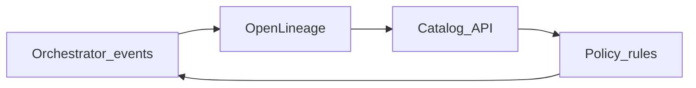

# Metadata Automation

## Problem

Catalog entries, lineage, and SLA tags lag reality when updated manually after each deploy. **Metadata automation** syncs orchestrator state ↔ catalog continuously.

## Automation flows

| Trigger | Automated action |
| --- | --- |
| DAG deploy (CI) | Register/update dataset stubs in catalog |
| Task success | Update last_refreshed, row count stats |
| Schema change task | Bump schema version in registry |
| New dependency in code | OpenLineage → lineage graph edge |
| SLA breach | Tag dataset t_risk; notify owner |

## Implementation stack

| Component | Options |
| --- | --- |
| Lineage | OpenLineage, Dagster events, native asset materializations |
| Catalog | DataHub, Alation, Collibra, Unity Catalog |
| Sync worker | Custom lambda, Marquez, catalog ingestion jobs |

## Related

- [Metadata Orchestration](02.03.04.02.07_Metadata_Orchestration.md)
- [Active Metadata](../../02.03.01_Fundamentals/02.03.01.06_Active_Metadata/02.03.01.06.01_Active_Metadata.md)
