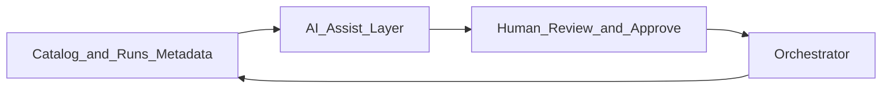

# AI-Assisted Data Engineering Overview

## Problem

Data teams spend cycles on boilerplate: DAG scaffolding, mapping docs, test cases, and incident triage. **AI-assisted data engineering** embeds LLM and agent capabilities into the **orchestration lifecycle** - design, build, test, operate - with human review gates.

## Scope in orchestration

| Phase | AI assist |
| --- | --- |
| **Design** | Pipeline suggestions from metadata |
| **Build** | Code generation for tasks and dbt models |
| **Test** | Synthetic data and test case generation |
| **Operate** | Root-cause hints from failed runs + lineage |
| **Govern** | Auto-tagging, lineage enrichment, policy checks |

## Guardrails

- Never auto-deploy to prod without CI and human approval
- PII masking before sending logs/SQL to external models
- Audit trail for generated artifacts

## Pattern docs in this section

| Doc | Focus |
| --- | --- |
| [Agentic Data Engineering](02.03.04.04.02_Agentic_Data_Engineering.md) | Autonomous agents in workflows |
| [AI Code Generation](02.03.04.04.03_AI_Code_Generation.md) | Task and DAG codegen |
| [AI Pipeline Generation](02.03.04.04.08_AI_Pipeline_Generation.md) | End-to-end pipeline drafts |
| [Autonomous Data Platforms](02.03.04.04.10_Autonomous_Data_Platforms.md) | Vision and limits |

## Related

- [Orchestration Strategy](../../02.03.01_Fundamentals/02.03.01.02_Strategy/02.03.01.02.01_Orchestration_Strategy.md)
- [Metadata-Driven Framework](../02.03.04.02_Metadata_Driven/02.03.04.02.01_Metadata_Driven_Framework.md)
