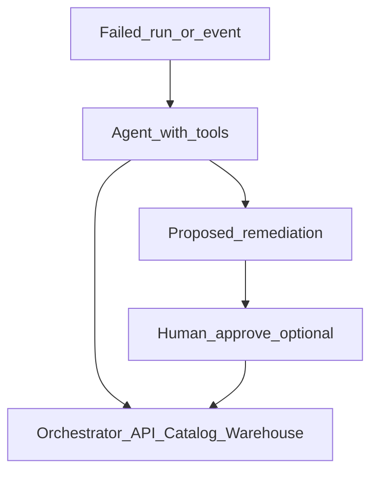

# Agentic Data Engineering

## Problem

Static DAGs cannot adapt to **unexpected schema drift**, **partial file arrivals**, or **multi-step remediation** without human intervention. **Agentic** patterns use LLM agents with **tools** (orchestrator API, catalog, SQL runner) to decide next steps within guardrails.

## Pattern

## Agent tool examples

| Tool | Use |
| --- | --- |
| list_failed_tasks(dag_id) | Triage |
| get_lineage(dataset) | Blast radius |
| 	rigger_dag(conf) | Rerun with params |
| 
un_sql_readonly(query) | Investigate |
| create_jira_ticket() | Escalate |

## Orchestration integration

| Level | Maturity |
| --- | --- |
| **L1 Copilot** | Suggest fix in PR comment | 
| **L2 Semi-auto** | Agent opens PR with patch |
| **L3 Auto-remediate** | Retry with dynamic conf (bounded) |
| **L4 Autonomous** | Not recommended for prod without strict policy |

Use **Temporal** or **Step Functions** for durable agent workflows with timeouts and compensation.

## Risks

- Unbounded API calls → cost and blast radius
- Hallucinated SQL → read-only sandboxes first
- Compliance → no prod credentials to external agents

## Related

- [AI Data Engineering Overview](02.03.04.04.01_AI_Data_Engineering_Overview.md)
- [Autonomous Data Platforms](02.03.04.04.10_Autonomous_Data_Platforms.md)
