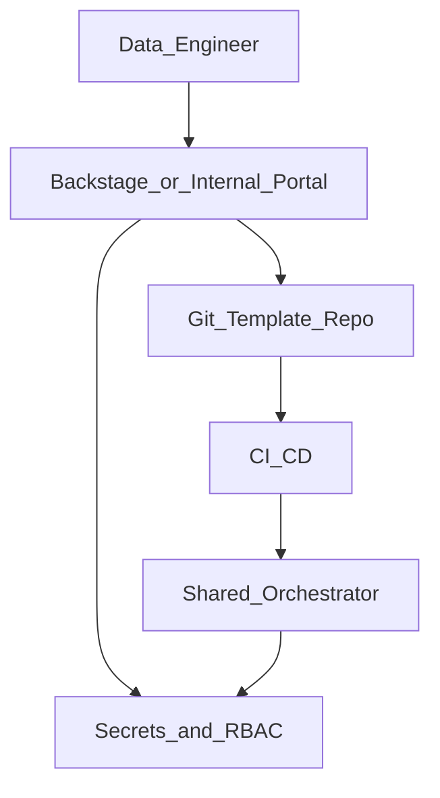

# Self-Service Platform Integration

## Problem

Data engineers need pipelines **without ticketing every connection and deploy**. Self-service integrates orchestration with **portal, templates, and policy** so teams onboard safely.

## Integration architecture

## Integration points

| System | Integration | Orchestration outcome |
| --- | --- | --- |
| **Portal** | Scaffolds repo, registers team namespace | New DAG repo in 15 min |
| **IAM / vault** | Auto-provision connection stubs | No shared prod credentials |
| **CI** | Team pipeline from template | Parse test on every PR |
| **Orchestrator API** | Sync on merge to team folder | DAG live in dev then prod |
| **Catalog** | Register datasets on deploy | Lineage from day one |
| **Cost tags** | Mandatory `cost_center`, `domain` | Chargeback reports |

## Self-service guardrails

| Guardrail | Enforcement |
| --- | --- |
| Approved operators only | CI allow-list import scan |
| Max runtime / retries | Policy on DAG default args |
| Prod deploy approval | Environment protection rules |
| Connection scope | Team cannot use other team conn ids |

## Related

- [Self-Service Engineering](02.03.08.02_Self_Service_Engineering.md)
- [Internal Developer Platform](../02.03.04_Architecture_Patterns/02.03.04.03_Platform_Patterns/02.03.04.03.01_Internal_Developer_Platform.md)
- [Multi-Tenant Platform Reference](../02.03.09_Reference_Architectures/02.03.09.04_Multi_Tenant_Data_Platform_Reference.md)