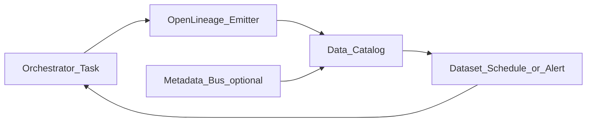

# Catalog and Lineage Integration

## Problem

Orchestration without catalog integration produces **orphan runs** - no impact analysis, no dataset-triggered schedules, weak governance.

## Reference flow

## Integration patterns

| Pattern | Description |
| --- | --- |
| **Emit on task success** | Operator wrapper posts OpenLineage event |
| **Register on deploy** | CI creates/updates dataset stubs |
| **Sync run freshness** | Last success timestamp -> catalog SLA field |
| **Impact on failure** | Catalog notifies downstream owners from lineage |
| **Dataset-triggered DAG** | Airflow Datasets / Dagster assets from catalog URI |

## Catalog platforms

| Platform | Integration approach |
| --- | --- |
| DataHub | OpenLineage ingestion, Airflow plugin |
| Unity Catalog | Table FQN in lineage facets |
| Purview | ADF + custom lineage from Airflow |
| Collibra | API sync from metadata automation job |

## Required metadata contract

- Dataset URI / FQN stable across systems
- `dag_id`, task id, run id in lineage facets
- Owner and tier for alert routing

## Related

- [Active Metadata](../02.03.01_Fundamentals/02.03.01.06_Active_Metadata/02.03.01.06.01_Active_Metadata.md)
- [Metadata Automation](../02.03.04_Architecture_Patterns/02.03.04.02_Metadata_Driven/02.03.04.02.06_Metadata_Automation.md)
- [Metadata Reference Architecture](../02.03.09_Reference_Architectures/02.03.09.01_Metadata_Reference_Architecture.md)