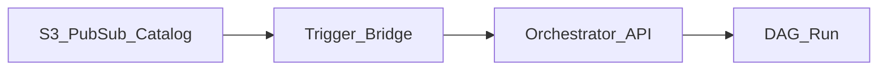

# Event-Driven Trigger Integration

## Problem

Batch pipelines should start when **events** occur - file landed, stream checkpoint, catalog freshness - not only at fixed cron.

## Trigger sources

| Source | Event | Orchestrator action |
| --- | --- | --- |
| **Object storage** | S3/GCS blob created | Lambda/Cloud Function -> trigger DAG |
| **Message bus** | Kafka/Pub/Sub message | Consumer calls orchestrator REST |
| **Catalog** | Dataset updated | Dataset schedule / sensor |
| **CI/CD** | Deploy complete | Smoke test DAG |
| **Webhook** | SaaS callback | Airflow HTTP trigger / Kestra webhook |

## Idempotency and dedup

| Concern | Pattern |
| --- | --- |
| Duplicate events | `dag_run_id` dedup key, execution date logic |
| Partial files | Wait for manifest or multi-part complete flag |
| Storm of triggers | Rate limit queue, pool cap |

## Cloud mappings

| Cloud | Bridge pattern |
| --- | --- |
| AWS | EventBridge -> Lambda -> MWAA API |
| GCP | Eventarc -> Cloud Run -> Composer API |
| Azure | Event Grid -> Function -> ADF trigger |

## Related

- [Metadata Orchestration](../02.03.04_Architecture_Patterns/02.03.04.02_Metadata_Driven/02.03.04.02.07_Metadata_Orchestration.md)
- [Scheduling Patterns](../02.03.01_Fundamentals/02.03.01.03_Core_Concepts/02.03.01.03.01_Scheduling_Patterns.md)