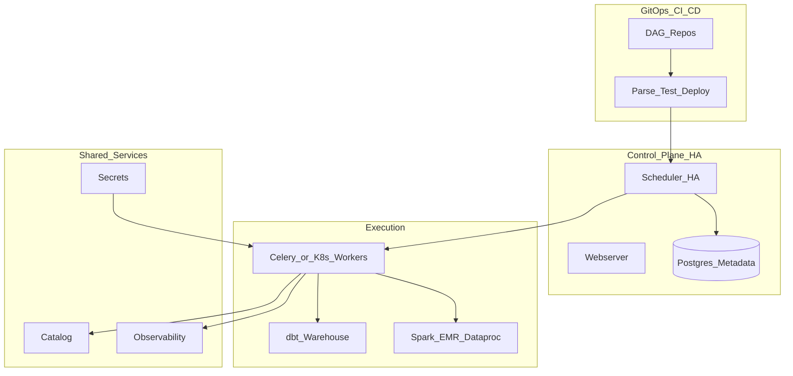

# Enterprise Batch Orchestration Reference Architecture

## Purpose

Reference for **large-scale nightly/hourly ELT** - multi-team Airflow (or equivalent) on managed Kubernetes with shared services.

## Architecture

## Design decisions

| Decision | Rationale |
| --- | --- |
| Managed Airflow (Composer/MWAA) or K8s Airflow | Reduce scheduler ops |
| Celery or K8s executor | Burst parallelism for ELT |
| dbt in DAG | Transform standardization |
| Per-team pools | Noisy neighbor isolation |
| Central observability | Single pane for 1000+ DAGs |

## Scaling guidelines

| Scale | DAGs | Workers | Metadata DB |
| --- | ---: | ---: | --- |
| Medium | 50-200 | 10-30 | db.r6g.large |
| Large | 200-1000 | 30-100 | db.r6g.xlarge+ HA |
| Very large | 1000+ | 100+ sharded teams | Dedicated DBA tuning |

## Related

- [Composer vs MWAA comparison](../02.03.06_Comparisons/02.03.06.02_Composer_vs_MWAA_vs_Self_Hosted_Airflow.md)
- [Enterprise Batch system design case](../02.03.07_Interview_Questions/02.03.07.05_System_Design_Orchestration_Cases.md)