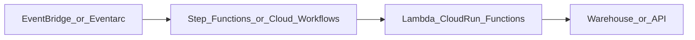

# Serverless Orchestration Reference Architecture

## Purpose

Reference for **low-ops glue workflows** - event triggers, short chains, no persistent worker fleet.

## Architecture

## When this fits

| Fit | Not fit |
| --- | --- |
| < 30 min steps, API calls | Multi-hour Spark jobs |
| Spiky, infrequent runs | 500+ interdependent batch DAGs |
| Cloud-native IAM | Portable multi-cloud DAG mesh |

## AWS reference stack

EventBridge -> Step Functions -> Lambda / Glue / Batch -> S3/Redshift. Heavy ELT delegated to **MWAA** separately.

## GCP reference stack

Eventarc -> Cloud Workflows -> Cloud Run / BigQuery jobs. Batch analytics on **Composer**.

## Hybrid pattern

**Serverless for edges**, **Airflow for core ELT** - linked via orchestrator API triggers.

## Related

- [Step Functions vs Cloud Workflows](../02.03.06_Comparisons/02.03.06.05_Cloud_Workflows_vs_Step_Functions.md)
- [Event-Driven Triggers](../02.03.08_Integration_Patterns/02.03.08.05_Event_Driven_Trigger_Integration.md)