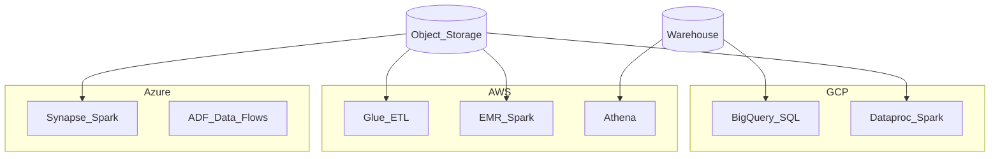

# Cloud Batch Transformation Reference Architecture

| Provider | Primary transform services | Learning guides |
| --- | --- | --- |
| GCP | BigQuery, Dataproc | [BigQuery](../02.02.02_GCP/04_BigQuery_SQL_Learning_Guide/README.md), [Dataproc](../02.02.02_GCP/03_Dataproc_Spark_Learning_Guide/README.md) |
| AWS | Glue, EMR, Athena | [Glue ETL](../02.02.03_AWS/03_Glue_ETL_Learning_Guide/README.md), [EMR](../02.02.03_AWS/04_EMR_Spark_Learning_Guide/README.md) |
| Azure | Synapse, ADF, Fabric | [Synapse](../02.02.04_Azure/03_Synapse_Spark_Learning_Guide/README.md), [ADF Flows](../02.02.04_Azure/04_ADF_Mapping_Data_Flows_Learning_Guide/README.md) |
