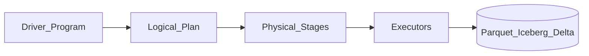

# 1. Apache Spark Overview

## What is Apache Spark?

**Apache Spark** is the dominant unified analytics engine for **large-scale batch and micro-batch transformation** on data lakes and warehouses. It provides DataFrame/Dataset APIs in Python, Scala, Java, and SQL with Catalyst optimizer and Tungsten execution.

## Mental model

- **Driver** - plans jobs, tracks stages, coordinates executors.
- **Executors** - run tasks in parallel; shuffle for joins/aggregations.
- **Tables** - read/write via Hive metastore, Unity Catalog, or path-based open formats.

## When to use Spark

| Use Spark when... | Consider alternatives when... |
| --- | --- |
| TB+ batch transforms on object storage | Warehouse-only SQL (dbt + Snowflake/BQ) suffices |
| Complex joins, UDFs, ML feature prep in one engine | Sub-second streaming with strict event-time -> **Flink** |
| Multi-cloud portable lakehouse medallion | Simple file copy + SQL -> managed ELT SaaS |
| Team already on Databricks/EMR/Dataproc | Interactive BI only -> warehouse native SQL |

## Spark vs dbt vs Flink

| Engine | Sweet spot |
| --- | --- |
| **Spark** | Distributed batch/micro-batch on lake |
| **dbt** | Warehouse-native SQL transforms |
| **Flink** | Stateful stream processing, CEPS |

## Learning path

Continue to [Architecture](02_Architecture.md) or [Scenarios](04_Scenarios.md).
