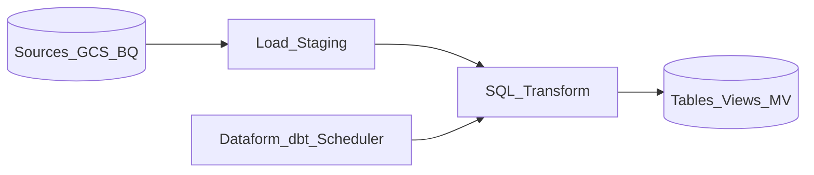

# 1. BigQuery SQL Transformation Overview

## What is BigQuery for transformation?

**BigQuery** is GCP's serverless **ELT warehouse**: raw and staged data land in datasets first, then transformations execute as SQL inside the warehouse. Google Cloud recommends **ELT** as the default integration pattern because BigQuery separates **storage** (Colossus-backed Capacitor format) from **compute** (Dremel query engine), scales without cluster management, and bills by **bytes processed** (on-demand) or **slot capacity** (Editions and reservations).[^1]

Transformation workloads are expressed as standard SQL and orchestrated through one or more of:

| Mechanism | Typical role |
| --- | --- |
| **Dataform** | Native GCP SQL pipelines with Git, tests, and workflow scheduling in BigQuery Studio |
| **dbt** | Cross-warehouse analytics engineering with packages, tests, and CI/CD |
| **Scheduled queries** | Lightweight cron-style batch refreshes |
| **Stored procedures / scripts** | Procedural logic and multi-statement transactions |
| **MERGE / DML** | Incremental fact and dimension loads |

The enterprise owns **model logic, data contracts, and promotion pipelines**; BigQuery owns **query planning, slot allocation, and managed runtime**.

## Mental model

- **Land** — ingest via load jobs, BigQuery Data Transfer Service, Datastream CDC, or federated queries; keep raw zones immutable where possible.
- **Transform** — SQL jobs read staging and intermediate datasets, apply business rules, and materialize curated outputs.
- **Serve** — downstream BI, reverse ETL, and **BigQuery ML** models consume tables, views, or materialized views in analytics datasets.

Under the hood:

- **Storage** — Capacitor columnar format with partition and cluster pruning.
- **Compute** — ephemeral query workers; no always-on cluster to right-size.
- **Governance** — IAM, row/column policies, and dataset-level isolation bound access to transform outputs.

## When to use BigQuery transforms

| Use BigQuery when... | Consider alternatives when... |
| --- | --- |
| Data already in **BigQuery datasets** or cheap to load there | Heavy file-based lake processing on open formats -> **Dataproc Spark** |
| **Serverless SQL marts** with dbt or Dataform and medallion layering | Record-level Python/Java logic, custom parsers, or graph UDFs -> **Spark** |
| **BigQuery ML**, geospatial, or nested JSON transforms in one engine | Sub-second streaming with event-time windows -> **Dataflow** |
| **GCP-native** IAM, scheduling, and zero-ops warehouse compute | Multi-cloud portable transform code -> **dbt + open table formats** |
| Incremental **MERGE** and **materialized views** meet SLA | Pre-load PII masking or format conversion before storage -> **Dataflow ETL** |

## BigQuery SQL vs Dataproc vs Dataflow

| Engine | Sweet spot |
| --- | --- |
| **BigQuery SQL** | Warehouse-native batch ELT, dimensional models, governed marts |
| **Dataproc Spark** | TB+ lakehouse transforms, complex UDFs, portable Spark code |
| **Dataflow** | Streaming ingestion, pre-load enrichment, non-SQL record processing |

**Rule of thumb:** if data is already in BigQuery and logic fits SQL, use BigQuery transforms (Dataform or dbt). Reach for Dataproc or Dataflow only when SQL cannot express the workload or processing must occur before load.[^2]

## Learning path

Continue to [Architecture](02_Architecture.md) for compute models and storage layout, or [Scenarios](04_Scenarios.md) for medallion and SCD patterns.

## Related

- [Cloud Batch Reference](../../01_Overview/01_Cloud_Batch_Transformation_Reference.md)
- [Dataform Learning Guide](../../03_Open_Source/11_Dataform_Learning_Guide/README.md)
- [dbt Learning Guide](../../03_Open_Source/03_dbt_Learning_Guide/README.md)
- [Dataproc Spark Learning Guide](../03_Dataproc_Spark_Learning_Guide/README.md)
- [Official BigQuery documentation](https://cloud.google.com/bigquery/docs)

[^1]: Google Cloud, "Data integration use cases — ELT," recommends loading data into BigQuery and transforming with SQL tools such as Dataform. https://cloud.google.com/use-cases/data-integration
[^2]: For GCP batch patterns, ELT with BigQuery is the default; ETL with Dataflow applies when transformation must occur before storage (streaming, PII masking, unsupported formats).