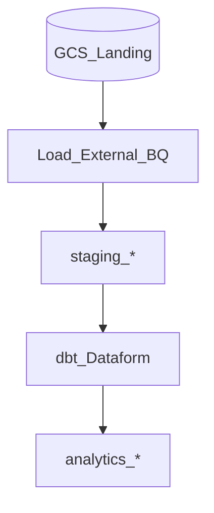

# 2. BigQuery Transformation Architecture

## Compute models

| Model | Character |
| --- | --- |
| **On-demand** | Pay per bytes scanned; simple start |
| **Editions / reservations** | Slot capacity; predictable cost at scale |
| **Autoscaling** | Burst within reservation |

## Storage layout

- **Partitioned tables** - `DATE`/`TIMESTAMP` partition pruning.
- **Clustering** - co-locate filter columns within partitions.
- **Materialized views** - pre-aggregated refresh (auto or manual).

## ELT topology on GCP

## Related

- [dbt Learning Guide](../../03_Open_Source/03_dbt_Learning_Guide/README.md)
