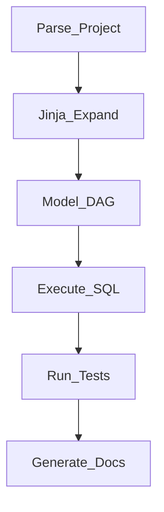

# 2. dbt Architecture

## Project structure

| Artifact | Purpose |
| --- | --- |
| `dbt_project.yml` | Project config, materializations defaults |
| `models/` | Layered SQL (`staging/`, `intermediate/`, `marts/`) |
| `seeds/` | CSV reference data |
| `snapshots` | SCD Type 2 for changing sources |
| `tests/` | Schema + singular tests |
| `macros/` | Jinja SQL functions |

## Execution flow

## Materialization strategies

| Strategy | Use case |
| --- | --- |
| `view` | Lightweight staging |
| `table` | Full rebuild marts |
| `incremental` | Append/merge large fact tables |
| `ephemeral` | CTE-like intermediate (no object) |

## Incremental patterns

- **`merge` strategy** - upsert on unique key (Snowflake, BQ, Databricks).
- **`delete+insert`** - partition replace.
- **`microbatch`** - dbt 1.9+ time-window incremental.

## Related

- [BigQuery dbt Learning Guide](../../02_Cloud_Services/02_GCP/04_BigQuery_SQL_Learning_Guide/README.md)
