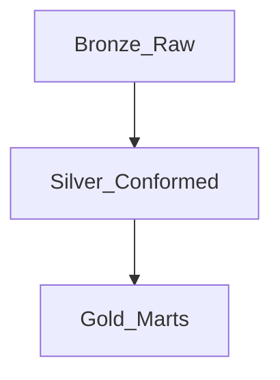
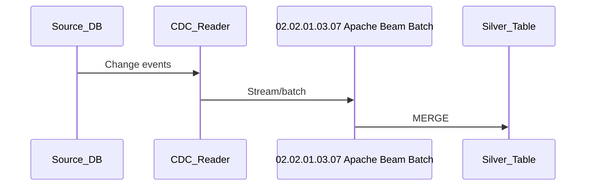

# 4. Apache Beam Batch Scenarios

## Enterprise medallion scenario

| Layer | 02.02.01.03.07 Apache Beam Batch role |
| --- | --- |
| Bronze | Land raw with minimal validation |
| Silver | Dedup, conform types, apply business keys |
| Gold | Aggregates and KPI tables for BI |

## SCD scenario

- **Type 1** — overwrite attributes on match.
- **Type 2** — close current row, insert new version.
- Use CDC stream or nightly staging diff.

## CDC scenario

## Conformed dimensions

Shared dim_date, dim_customer built once; fact tables reference surrogate keys.

## Enterprise pattern checklist

- [ ] Business keys documented
- [ ] Quarantine path for bad records
- [ ] Lineage registered in catalog
- [ ] Cost tag per domain

## Related

- [Medallion Implementation](../../../04_Shared_Foundations/01_Fundamentals/03_Medallion_And_Zones/01_Medallion_Implementation.md)
