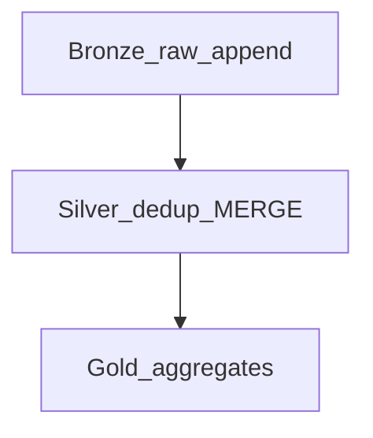

# Micro-Batch Medallion Architecture

## Layer flow

| Layer | NRT behavior | Storage |
| --- | --- | --- |
| Bronze | Append-only, minimal transform | Raw Delta/Iceberg |
| Silver | MERGE, conform, DQ gates | Curated Delta |
| Gold | Windowed aggregates or batch refresh | Mart tables |

## Incremental silver rules

- **Primary key** enforced at silver MERGE.
- **Late events** handled via watermark + optional side output quarantine.
- **Schema evolution** — additive columns only without migration window.

## Related

- [Medallion Implementation](../../../04_Shared_Foundations/01_Fundamentals/03_Medallion_And_Zones/01_Medallion_Implementation.md)
