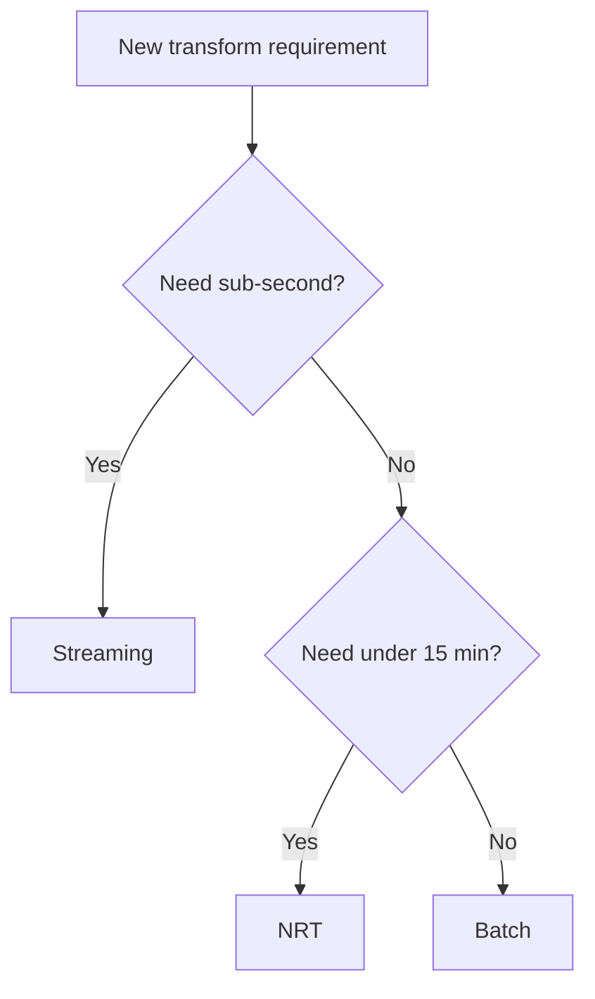

# Batch vs Streaming vs NRT Transformation

| Dimension | Batch | NRT (Micro-batch) | Streaming |
| --- | --- | --- | --- |
| **Latency SLA** | Minutes–hours | 1–15 minutes | Sub-second–seconds |
| **Compute model** | Scheduled job | Triggered micro-batch | Always-on |
| **State** | Minimal | Windowed/checkpoint | Full stateful |
| **Cost** | Lowest per TB | Medium | Highest |
| **Complexity** | Lowest | Medium | Highest |
| **Best examples** | Nightly ELT | Silver MERGE every 5m | Fraud scoring |
| **Engines** | Spark batch, dbt | SS trigger, DLT, Dataflow | Flink, Kafka Streams |

## Decision matrix

## Related

- [NRT Strategy](../../01_Fundamentals/01_Strategy/01_NRT_Transformation_Strategy.md)
