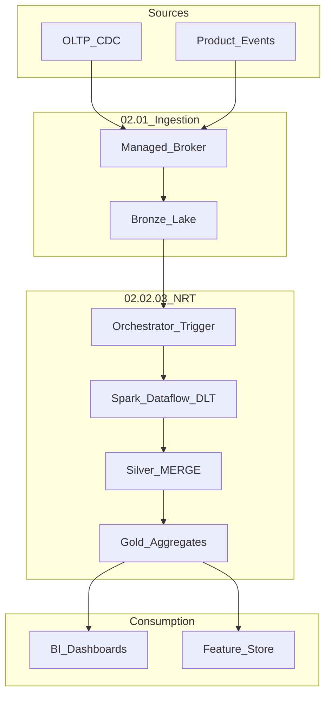

# NRT Lakehouse Transform Reference Architecture

## Enterprise reference

## Component responsibilities

| Layer | Technology examples | SLA |
| --- | --- | --- |
| Ingest | Pub/Sub, Kinesis, Debezium | < 1m to bronze |
| NRT transform | DLT, Glue SS, Dataflow | 2–10m to silver |
| Quality | Great Expectations, DLT expectations | Block publish on fail |
| Serve | Direct Lake, BQ, Snowflake | Query freshness tag |

## Related

- [Cloud NRT Reference](../02_Cloud_Services/01_Overview/01_Cloud_NRT_Transformation_Reference.md)
