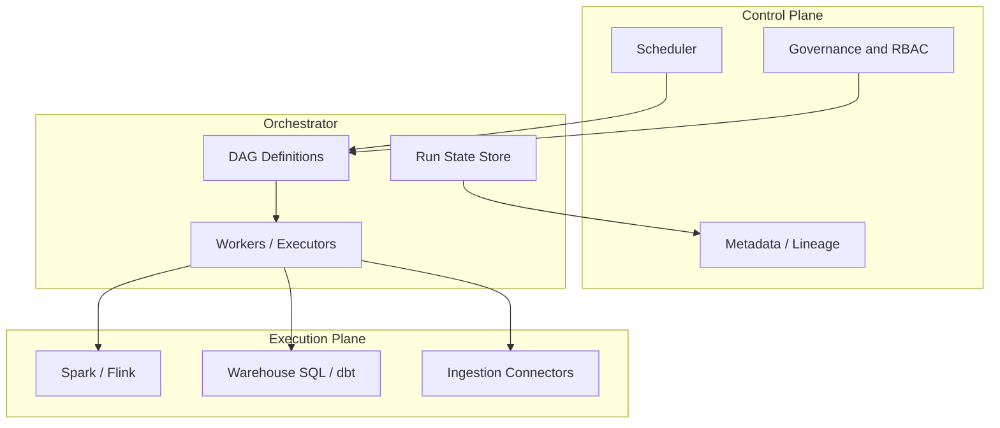

# What Is Data Orchestration

## Definition

**Data orchestration** is the coordinated scheduling, execution, monitoring, and recovery of data pipeline tasks across ingestion, transformation, quality checks, and publishing steps. An orchestrator maintains **workflow state** — which tasks ran, which failed, what depends on what — so pipelines complete reliably on time and in the correct order.

Unlike a single ETL script, orchestration separates **what** the pipeline does (business logic in Spark, dbt, SQL) from **when and how** it runs (dependencies, retries, SLAs, environments).

## Core responsibilities

| Responsibility | Description | Example |
| --- | --- | --- |
| **Scheduling** | Trigger runs by time, event, or upstream data availability | Daily 02:00 UTC cron; run when `raw.orders` lands |
| **Dependency resolution** | Execute tasks only after prerequisites succeed | Silver layer after Bronze validation passes |
| **State management** | Track run status, logs, and historical attempts | Task instance `success` / `failed` / `upstream_failed` |
| **Failure handling** | Retry, alert, block downstream, or trigger compensations | 3 retries with exponential backoff; PagerDuty on final failure |
| **Observability** | Expose lineage, duration, cost, and SLA compliance | Dashboard: "95% of finance DAGs met freshness SLO" |
| **Environment isolation** | Dev / staging / prod with promotion controls | Same DAG code, different connections and schedules |

## Orchestration vs related concepts

| Concept | Scope | Relationship to orchestration |
| --- | --- | --- |
| **Data ingestion** | Moving data from sources to landing zones | Orchestrator triggers and monitors ingestion jobs |
| **Stream processing** | Continuous event processing | Event-driven triggers or separate stream runtime; orchestrator handles batch backfills and operational jobs |
| **Workflow engine (BPM)** | Human tasks, approvals, long-lived business processes | Overlaps for operational workflows; data orchestrators optimize for high-volume batch DAGs |
| **Infrastructure provisioning** | Clusters, networks, IAM | Terraform/K8s provision compute; orchestrator submits jobs to that compute |
| **DataOps** | CI/CD, testing, release discipline for data | Governs how orchestrated pipelines are built and promoted |

## Typical architecture layers

1. **Control plane** — Schedules, policies, catalog integration, cost and SLA dashboards.
2. **Orchestrator** — Parses DAGs, queues tasks, persists state, coordinates workers.
3. **Execution plane** — Actual data movement and transformation (often delegated to Spark, BigQuery, dbt, Fivetran, etc.).

## When orchestration is required

- **Multi-step pipelines** with explicit ordering (landing → validate → transform → publish).
- **Cross-team dependencies** where Team A's output is Team B's input on a fixed schedule.
- **Regulated freshness** — finance close, marketing attribution, ML feature stores with daily cutoffs.
- **Operational scale** — hundreds of DAGs where manual job chaining is error-prone.
- **Backfill and recovery** — reprocess historical partitions after logic bugs or source corrections.

Single-table nightly loads with no downstream consumers may not need a full orchestrator; a managed scheduler (Cloud Scheduler + one job) can suffice.

## Common orchestrator categories

| Category | Examples | Strength |
| --- | --- | --- |
| **Open-source DAG engines** | Apache Airflow, Prefect, Dagster | Ecosystem depth, self-host or managed |
| **Cloud managed workflow** | AWS Step Functions, GCP Cloud Composer / Workflows, Azure Data Factory | Low ops, native IAM and billing |
| **Metadata-native** | Dagster (assets), Azure Fabric pipelines | Data-aware dependencies, lineage-first |
| **Hybrid / platform** | Astronomer, MWAA, Cloud Composer | Managed Airflow with enterprise support |

## Design principles

1. **Thin orchestration, fat execution** — Keep heavy transforms in the engine best suited for the workload (Spark, warehouse SQL); orchestrator coordinates only.
2. **Idempotent tasks** — Safe retries require deterministic task boundaries (partition keys, merge/upsert semantics).
3. **Explicit dependencies** — Prefer declared DAG edges and dataset triggers over implicit timing ("run B 2 hours after A").
4. **Observable by default** — Every task emits structured logs, metrics, and lineage hooks.
5. **Environment parity** — Same DAG structure in dev and prod; differ only config (connections, variables, schedule).

## Related

- [Orchestration vs Choreography](02_Orchestration_vs_Choreography.md)
- [Orchestration Reference Model](03_Orchestration_Reference_Model.md)
- [Orchestration Strategy](../02_Strategy/01_Orchestration_Strategy.md)
- [Scheduling Patterns](../03_Core_Concepts/01_Scheduling_Patterns.md)
- [Choreography vs Orchestration](../../../01_Data_Ingestion_Architecture/02_Streaming/04_Architecture_Patterns/01_Event_Driven_Patterns/01_Choreography_vs_Orchestration.md)
