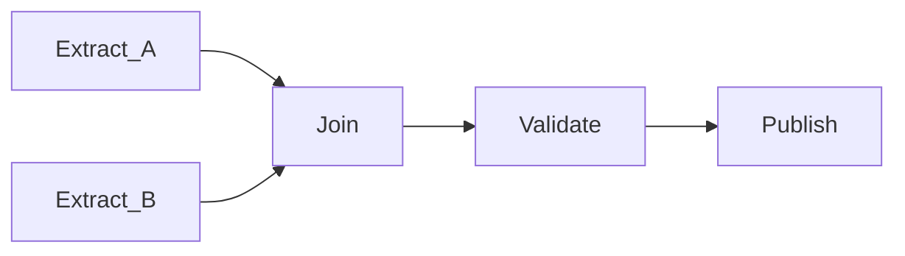

# Dependency Management

Dependencies define **execution order** and **data readiness** between tasks and DAGs. Correct dependency design prevents reading incomplete data, enables parallelization, and clarifies blast radius on failure.

## Dependency categories

| Type | Scope | Example |
| --- | --- | --- |
| **Task → task (intra-DAG)** | Same DAG | `extract >> validate >> transform` |
| **Task group** | Logical grouping | `ingestion_group >> modeling_group` |
| **Cross-DAG** | External DAG sensor / trigger | Finance mart waits for `orders_daily` success |
| **Data / dataset** | Logical data product | `Dataset("s3://curated/orders")` consumed by downstream DAG |
| **External system** | API, file, partition | S3 key exists; BigQuery partition loaded |
| **Resource** | Pool, slot, lock | Only 3 concurrent warehouse jobs |

## Intra-DAG patterns

| Pattern | Syntax concept | When |
| --- | --- | --- |
| **Linear chain** | `a >> b >> c` | Strict sequence |
| **Fan-out / fan-in** | Multiple upstream → one join | Parallel extract, single merge |
| **Branching** | `@task.branch` / `BranchPythonOperator` | Route on validation outcome |
| **Trigger rule** | `all_success`, `one_failed`, `none_failed_min_one_success` | Join semantics after partial failure |

**Trigger rules matter:** Default `all_success` skips downstream if any upstream fails. Use explicit rules for cleanup or notification branches.

## Cross-DAG dependencies

| Mechanism | Pros | Cons |
| --- | --- | --- |
| **ExternalTaskSensor** | Simple, native in Airflow | Tight coupling to external DAG id + execution date alignment |
| **TriggerDagRunOperator** | Explicit downstream kick | Must handle duplicate triggers |
| **Dataset updates** | Loose coupling via catalog URI | Requires Airflow 2.4+ / platform support |
| **Metadata flag table** | Portable across orchestrators | Manual contract discipline |

**Execution date alignment:** External sensors must map logical dates correctly (`execution_date_fn`) or downstream reads wrong partition.

## Data-aware dependencies (recommended)

Replace time gaps with **dataset** or **asset** dependencies:

| Legacy | Data-aware |
| --- | --- |
| Wait 3 hours after upstream cron | Downstream triggered when `orders_curated` dataset updates |
| Sensor on `_SUCCESS` file | Dataset URI or table snapshot in catalog |
| Implicit "tables ready at 6am" | Freshness check in catalog triggers orchestration |

Benefits: clearer lineage, fewer wasted sensor pokes, self-documenting contracts.

## Dynamic dependencies

| Feature | Use case |
| --- | --- |
| **Dynamic task mapping** | One task per source file or country partition |
| **Mapped dependencies** | Expand fan-out based on runtime list |
| **Parametric DAGs** | Same structure, different config per environment |

Guardrails: cap mapped task count; use pools to avoid thundering herd.

## Dependency anti-patterns

1. **Hidden temporal coupling** — "We always run at 5am because upstream finishes ~4:30" with no sensor or dataset.
2. **Diamond without join** — Parallel paths write same partition without merge semantics (race conditions).
3. **Circular dependencies** — DAG A waits on B waits on A; scheduler deadlock or undefined behavior.
4. **Mega external sensor chains** — DAG waits on 20 upstream DAGs with fragile date math.
5. **Cross-environment leakage** — Prod DAG sensor pointing at dev DAG id.

## Failure propagation

| Upstream state | Default downstream (all_success) | Options |
| --- | --- | --- |
| Success | Runs | — |
| Failed | Skipped | Fix upstream; clear and rerun |
| Skipped | Skipped | Use trigger rules for optional paths |
| Upstream failed (mapped) | Partial skip | `trigger_rule=none_failed_min_one_success` for joins |

Document **which failures block SLAs** vs optional enrichment paths.

## Cross-team contract template

| Field | Description |
| --- | --- |
| **Producer DAG / asset** | Name, owner, schedule |
| **Output artifact** | Table, path, partition scheme |
| **Freshness SLA** | e.g., daily by 04:00 UTC |
| **Schema contract** | Versioned schema / data contract link |
| **Consumer DAGs** | List with contact |
| **Breaking change process** | Notice period, dual-write window |

## Tooling integration

- **OpenLineage / Marquez** — Infer task-level lineage for impact analysis.
- **Data catalog** — Register datasets tied to orchestrator URIs.
- **dbt** — `ref()` defines transform graph; orchestrator wraps dbt run after ingestion completes.

## Related

- [Scheduling Patterns](01_Scheduling_Patterns.md)
- [Retry Strategies](03_Retry_Strategies.md)
- [Orchestration vs Choreography](../01_Overview/02_Orchestration_vs_Choreography.md)
- [Metadata Orchestration](../../04_Architecture_Patterns/02_Metadata_Driven/07_Metadata_Orchestration.md)
