# SLA Management for Orchestrated Pipelines

**SLA management** ties orchestration run outcomes to **business commitments**: when data must be fresh, how long pipelines may run, and what happens when deadlines are missed. SLAs drive prioritization, alerting tiers, and platform investment.

## Terminology

| Term | Definition | Example |
| --- | --- | --- |
| **SLA** | Business agreement with consequences | "Finance ledger available by 06:00 EST" |
| **SLO** | Internal target measuring SLA | "99% of runs complete by 05:45" |
| **SLI** | Measurable indicator | DAG run end time vs deadline |
| **Error budget** | Allowed misses per period | 1 failed day per month ≈ 97% SLO |

Data platforms typically implement **SLOs with SLI metrics**; legal SLAs sit above for external or regulatory commitments.

## SLA dimensions for data pipelines

| Dimension | Question | SLI metric |
| --- | --- | --- |
| **Freshness** | When is data ready for consumers? | `completion_time - data_interval_end` |
| **Completeness** | Did all expected partitions load? | Row count vs baseline; partition exists |
| **Duration** | How long did the run take? | DAG run wall time |
| **Correctness** | Did quality checks pass? | Failed checks count (linked to observability) |
| **Availability** | Could the pipeline be triggered? | Scheduler uptime; successful trigger rate |

Orchestration directly controls **freshness** and **duration**; correctness often delegated to quality tasks in the same DAG.

## Tiering model

| Tier | Business impact | Freshness example | Alerting |
| --- | --- | --- | --- |
| **T0 — Critical** | Regulatory, revenue close | Fixed wall-clock deadline | Page on-call immediately |
| **T1 — High** | Executive dashboards, ML production | Same-day within N hours | Slack + ticket if miss |
| **T2 — Standard** | Operational analytics | Best effort + next-day OK | Dashboard only |
| **T3 — Experimental** | POC, sandbox | No SLA | None |

Tag every DAG with `tier` in metadata; enforce stricter change control on T0/T1.

## Defining an orchestration SLA

1. **Identify consumer deadline** — When does BI, ML, or downstream API need data?
2. **Subtract buffer** — Validation, propagation to cache, timezone rollups (typically 15–60 min).
3. **Set SLO completion time** — Latest acceptable DAG `end_date` for the data interval.
4. **Allocate duration budget** — Per-task timeouts so sum fits SLO.
5. **Document dependencies** — Upstream SLAs must sum to less than downstream deadline.

```mermaid
gantt
  title Daily Orders Pipeline SLA (UTC)
  dateFormat HH:mm
  axisFormat %H:%M
  section Ingest
  Extract_complete :done, 00:30, 90m
  section Transform
  Silver_and_Gold :active, 02:00, 120m
  section SLA
  Consumer_deadline :milestone, 05:00, 0m
```

## Monitoring and alerting

| Signal | Source | Alert condition |
| --- | --- | --- |
| Run not started | Scheduler | No DAG run by `schedule + grace` |
| Run in progress too long | Task durations | Exceeds p95 + threshold |
| Run failed | Task state | Final failure after retries |
| SLA miss | Custom SLA sensor / metric | `now > deadline AND not success` |
| Upstream breach | Cross-DAG metadata | External DAG missed SLO |

**SLA sensors** (Airflow `SqlSensor` or deadline operators) mark breach even if tasks still running — triggers escalation before silent lateness.

## SLA dashboards

Track per DAG and aggregate by domain:

- On-time completion rate (7d / 30d rolling)
- Median and p95 duration trend
- Miss root cause (failed task vs slow warehouse vs late upstream)
- Mean time to recovery after miss

Integrate with [Platform Observability](../../02_Cloud_Services/02.03.02.06_Platform_Engineering/02.03.02.06.07_Platform_Observability.md) and data observability stack.

## Operational response playbook

| Scenario | Action |
| --- | --- |
| **Impending miss** | Scale pool slots; kill non-critical DAGs; notify consumers |
| **Miss occurred** | Incident ticket; communicate ETA; optional stale data flag in catalog |
| **Root cause fixed** | Targeted backfill; postmortem for T0/T1 |
| **Chronic miss** | Architecture review — split DAG, optimize SQL, change schedule |

## Contract with consumers

Publish in catalog or data contract:

- **Dataset name** and **owner**
- **Update frequency** and **freshness SLO**
- **Supported lag** for backfills
- **Contact** for delays

Orchestration metadata should expose the same SLO as API fields where possible.

## FinOps linkage

Missed SLAs often correlate with **cost spikes** (emergency large clusters). Track cost per SLA tier; right-size schedules to meet SLO without over-provisioning 24/7 workers.

## Related

- [Scheduling Patterns](01_Scheduling_Patterns.md)
- [Retry Strategies](03_Retry_Strategies.md)
- [Orchestration Governance](../04_Governance/01_Orchestration_Governance.md)
- [Enterprise DataOps Playbook](../05_DataOps/03_Enterprise_DataOps_Playbook.md)
