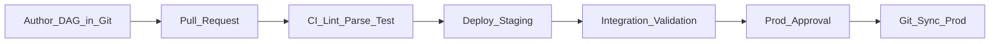

# Orchestration Governance

Orchestration governance defines **who may author, deploy, and operate** workflows; **how changes are reviewed**; and **what audit evidence** exists for regulated pipelines. Without governance, production DAGs become unreviewable, over-privileged, and fragile.

## Governance scope

| Area | Policy question |
| --- | --- |
| **Ownership** | Who owns each DAG and on-call rotation? |
| **Access control** | Who can trigger prod runs, backfills, or edit connections? |
| **Change management** | How do DAG changes reach prod (CI vs UI)? |
| **Secrets** | Where are credentials stored and rotated? |
| **Environments** | What is allowed in dev vs staging vs prod? |
| **Audit** | Can we prove who ran what and when? |
| **Standards** | Required tags, tiers, documentation, tests |

## RACI model

| Activity | Platform team | Domain data eng | Security | Data governance |
| --- | --- | --- | --- | --- |
| Orchestrator runtime HA | **R/A** | I | C | I |
| DAG authoring | C | **R/A** | I | C |
| Prod deployment approval | **A** | R | C | C |
| Connection / secret policy | **R** | I | **A** | I |
| SLA tier assignment | C | R | I | **A** |
| Incident response T0 | C | **R** | I | I |

R = Responsible, A = Accountable, C = Consulted, I = Informed

## Access control (RBAC)

| Role | Permissions |
| --- | --- |
| **Viewer** | Read DAG, run history, logs |
| **Operator** | Trigger DAG, clear failed tasks (non-prod) |
| **Developer** | Deploy to dev/staging via CI |
| **Prod deployer** | Merge to prod branch; limited group |
| **Admin** | Connections, pools, user management — platform only |

**Principles:**

- **No shared prod admin accounts** — individual identity via SSO (OAuth/SAML).
- **Least privilege on connections** — prod warehouse roles scoped to required datasets.
- **Separate prod orchestrator** — or namespace isolation with policy enforcement.
- **Backfill authorization** — T0/T1 backfills require ticket or second approver.

## Change management workflow

| Gate | Requirement |
| --- | --- |
| PR review | Peer + platform for new operators or connections |
| CI | `dagbag import`, lint, unit tests, no secret scan failures |
| Staging | Successful run on sample partition |
| Prod | Tagged release; no hot-edit in UI (except break-glass) |

**Break-glass:** Emergency UI fix allowed with mandatory post-incident Git backfill within 24 hours.

## Mandatory DAG metadata

| Tag / field | Purpose |
| --- | --- |
| `owner` | Team email or PagerDuty service |
| `tier` | T0–T3 SLA tier |
| `domain` | Business domain for chargeback |
| `data_products` | Catalog URIs produced |
| `runbook_url` | Link to operational runbook |
| `version` | Semantic version or Git SHA |

Enforce via CI policy-as-code (reject merge if missing).

## Connection and secrets governance

- Store secrets in **Vault / Secret Manager / AWS Secrets Manager** — orchestrator references by id.
- **Rotate** credentials on schedule; automate connection updates where API allows.
- **Audit** connection access quarterly; remove unused integrations.
- **Never** commit secrets to Git — pre-commit hooks + secret scanning.

## Audit and compliance

| Event | Retained evidence |
| --- | --- |
| DAG run triggered | User/service account, timestamp, params |
| Task success/fail | Logs, exit code, retry count |
| Backfill | Initiator, date range, approval ticket |
| Connection change | Admin audit log |
| Manual mark success | Rare; requires reason code |

Retention: align with regulatory requirements (often 1–7 years for finance). Export metadata DB or use vendor audit APIs.

## Quality and testing standards

| Test type | Requirement by tier |
| --- | --- |
| DAG parse / import | All tiers — CI blocking |
| Unit tests on task logic | T0–T1 required |
| Staging integration run | T0–T1 required before prod |
| Data quality checks in DAG | T0–T2 recommended |

See [Data Testing Strategy](../../04_Architecture_Patterns/01_DataOps_Patterns/05_Data_Testing_Strategy.md).

## Deprecation and lifecycle

1. **Announce** DAG deprecation in catalog; notify consumers.
2. **Disable schedule** — set `is_paused` or remove from deploy bundle.
3. **Retain** read-only history for audit period.
4. **Delete** DAG code after consumer migration confirmed.

## Related

- [Platform Governance](02_Platform_Governance.md)
- [SLA Management](../03_Core_Concepts/04_SLA_Management.md)
- [DataOps Framework](../05_DataOps/01_DataOps_Framework.md)
- [Orchestration Strategy](../02_Strategy/01_Orchestration_Strategy.md)
