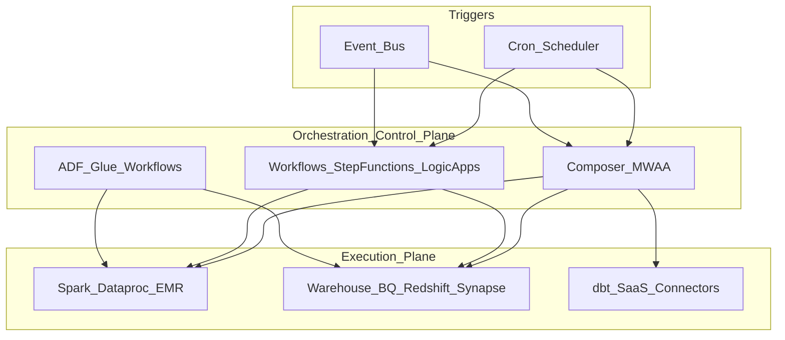

# Cloud Orchestration Reference Architecture

## Purpose

Hyperscaler mapping for **managed data pipeline orchestration** — workflow control planes, serverless orchestrators, ETL factory services, and event-driven triggers. Use this matrix to shortlist services before deep-diving into per-cloud architecture docs.

## Service categories

| Category | Role | When to use |
| --- | --- | --- |
| **Managed Airflow** | Full DAG orchestrator (Airflow API) | Complex batch DAGs, existing Airflow skills, rich operator ecosystem |
| **Serverless workflow** | State machine / YAML workflow engine | Short-to-medium chains, Lambda/Functions steps, minimal ops |
| **Data factory / ETL orchestrator** | Visual + code pipelines with copy/transform activities | Azure-centric or low-code ETL orchestration |
| **Job workflow (analytics)** | Orchestrate Spark/ETL jobs on managed analytics | Glue-centric AWS lakehouse pipelines |
| **Scheduler / trigger** | Time and event triggers feeding orchestrators | Cron, webhooks, bus events — not a full DAG engine alone |

## Hyperscaler service catalog

### Google Cloud (GCP)

| Service | Category | Description |
| --- | --- | --- |
| [**Cloud Composer**](../02_GCP/02.03.02.02.01_Cloud_Composer_Architecture.md) | Managed Airflow | Managed Apache Airflow on GKE; primary GCP batch orchestrator |
| [**Cloud Workflows**](../02_GCP/02.03.02.02.02_Cloud_Workflows_Architecture.md) | Serverless workflow | HTTP/gRPC steps, connectors, long-running serverless orchestration |
| **Cloud Scheduler** | Scheduler | Cron HTTP/Pub/Sub triggers for Composer, Workflows, Cloud Run |
| **Dataproc Serverless / Batches** | Job runtime | Spark job execution — orchestrated *by* Composer/Workflows, not a DAG engine |
| **Cloud Run / Cloud Functions** | Task runtime | Single-step tasks invoked from Workflows or Airflow operators |

### Amazon Web Services (AWS)

| Service | Category | Description |
| --- | --- | --- |
| [**MWAA**](../03_AWS/02.03.02.03.01_MWAA_Architecture.md) | Managed Airflow | Managed Workflows for Apache Airflow on AWS |
| [**Step Functions**](../03_AWS/02.03.02.03.02_Step_Functions_Architecture.md) | Serverless workflow | State machines; Standard and Express workflows |
| [**Glue Workflows**](../03_AWS/02.03.02.03.03_Glue_Workflows_Architecture.md) | Job workflow | Orchestrate Glue crawlers, jobs, triggers inside AWS Glue |
| **EventBridge** | Scheduler / trigger | Rules, schedules, event buses triggering Step Functions / Lambda |
| **AWS Batch** | Job runtime | Container/batch jobs — tasks within Step Functions or Airflow |
| **Amazon EMR** | Job runtime | Spark clusters — submitted via Airflow operators or Step Functions |

### Microsoft Azure

| Service | Category | Description |
| --- | --- | --- |
| [**Azure Data Factory (ADF)**](../04_Azure/02.03.02.04.01_Azure_Data_Factory_Architecture.md) | Data factory | Pipeline activities, triggers, SSIS/IR integration, Fabric alignment |
| [**Logic Apps**](../04_Azure/02.03.02.04.02_Logic_Apps_Architecture.md) | Serverless workflow | Connector-based workflows, enterprise integration patterns |
| **Microsoft Fabric Data Factory** | Data factory | Fabric-native pipelines; successor path for many ADF workloads |
| **Azure Container Apps Jobs** | Task runtime | Event-driven job execution from ADF or Logic Apps |

## Capability matrix

| Capability | GCP | AWS | Azure |
| --- | --- | --- | --- |
| **Primary managed Airflow** | Cloud Composer 2/3 | MWAA | Self-host on AKS or partner; Fabric evolving |
| **Primary serverless orchestrator** | Cloud Workflows | Step Functions | Logic Apps |
| **Visual ETL orchestration** | Cloud Data Fusion (limited) | Glue Studio + Workflows | ADF / Fabric |
| **Cron scheduling** | Cloud Scheduler | EventBridge Scheduler | ADF / Logic Apps triggers |
| **Event-driven trigger** | Eventarc, Pub/Sub | EventBridge | Event Grid |
| **OpenLineage / lineage** | Dataplex, Data Catalog | Glue Catalog, lineage via integrations | Microsoft Purview |
| **Private connectivity** | VPC-SC, Private IP Composer | VPC, MWAA in private subnets | Managed VNet IR, private endpoints |
| **Typical batch DAG home** | Composer | MWAA | ADF (+ Airflow on AKS if required) |

## Reference diagram

## Selection guide (quick)

| Need | Prefer |
| --- | --- |
| Large Airflow DAG portfolio, portable code | **Composer** (GCP) or **MWAA** (AWS) |
| Serverless, per-step billing, &lt; 30 min tasks | **Cloud Workflows**, **Step Functions**, **Logic Apps** |
| Azure lakehouse, copy/transform activities | **ADF** / **Fabric** pipelines |
| Glue-centric lake on AWS | **Glue Workflows** + Step Functions for external steps |
| Multi-cloud portable orchestration code | **Airflow** (Composer/MWAA) or **Prefect/Dagster** on K8s |
| Human approval / B2B integration | **Logic Apps** or **Step Functions** + callback |

See [Managed Workflows](02_Managed_Workflows.md) for detailed comparison of managed offerings.

## Design principles

1. **One primary control plane per environment** — Avoid overlapping Composer + ad-hoc Cloud Scheduler chains for the same pipeline tier.
2. **Thin orchestrator, fat compute** — Orchestrator triggers Dataproc/EMR/BQ/Synapse; heavy logic stays in execution engines.
3. **Private connectivity** — No public orchestrator endpoints in production; use VPC/VNet integration.
4. **IAM least privilege** — Per-workload service accounts / roles; no shared admin keys.
5. **FinOps** — Tag DAG/workflow runs with `domain`, `cost_center`; right-size Composer/MWAA workers and Step Functions transitions.

## Related

- [Managed Workflows](02_Managed_Workflows.md)
- [Top 10 Orchestration Technologies](../../03_Top_10/README.md)
- [Orchestration Strategy](../../01_Fundamentals/02_Strategy/01_Orchestration_Strategy.md)
- [Cloud Composer](../02_GCP/02.03.02.02.01_Cloud_Composer_Architecture.md)
- [Cloud Composer Learning Guide](../02_GCP/03_Cloud_Composer_Learning_Guide/README.md)
- [Cloud Workflows Learning Guide](../02_GCP/04_Cloud_Workflows_Learning_Guide/README.md)
- [Glue Workflows Learning Guide](../03_AWS/06_Glue_Workflows_Learning_Guide/README.md)
- [ADF Learning Guide](../04_Azure/03_Azure_Data_Factory_Learning_Guide/README.md)
- [Logic Apps Learning Guide](../04_Azure/04_Logic_Apps_Learning_Guide/README.md)
- [MWAA Learning Guide](../03_AWS/04_MWAA_Learning_Guide/README.md)
- [Step Functions Learning Guide](../03_AWS/05_Step_Functions_Learning_Guide/README.md)
- [MWAA](../03_AWS/02.03.02.03.01_MWAA_Architecture.md)
- [Azure Data Factory](../04_Azure/02.03.02.04.01_Azure_Data_Factory_Architecture.md)
- [Multi-Cloud Orchestration Patterns](../05_Cross_Cloud/01_Multi_Cloud_Orchestration_Patterns.md)
