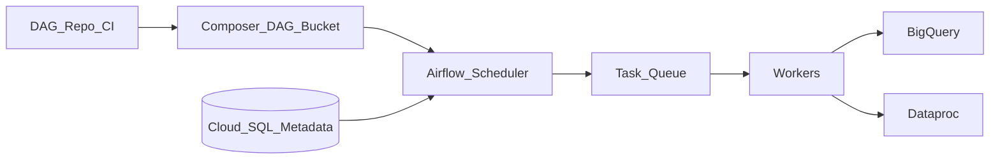

# 1. Cloud Composer Overview

## What is Cloud Composer?

**Cloud Composer** is Google Cloud's **managed Apache Airflow** offering (branded *Managed Service for Apache Airflow*). Google operates the Airflow scheduler, web server, workers, metadata database, and underlying GKE infrastructure. You author **DAGs in Python** (or import from Git) and use Airflow operators to orchestrate BigQuery, Dataproc, Cloud Storage, Dataflow, and hundreds of other systems.

Composer is the **default GCP control plane** for enterprise batch data pipelines when teams need DAG dependencies, backfills, SLAs, and the Airflow ecosystem.

## Mental model

- **You own** DAG code, connections, variables, and operational runbooks.
- **Google owns** patching, control-plane HA, and worker/node lifecycle on GKE.
- **Execution engines** (BigQuery, Spark, dbt) run **outside** the worker for heavy compute — workers orchestrate, not transform at scale.

## Composer generations

| Generation | Status | Notes |
| --- | --- | --- |
| **Composer 1** | Deprecated / being removed | Migrate to Composer 2 or 3 |
| **Composer 2** | Supported | Autoscaling workers; environment fee + compute SKUs |
| **Composer 3** | **Recommended** for new environments | Improved scaling; **DCU-based** billing (see [Costing](06_Costing.md)); Airflow 2.x+ |

Always create **Composer 3** for greenfield unless a blocking compatibility issue exists. Verify [supported Airflow versions](https://cloud.google.com/composer/docs/concepts/versioning) for your region.

## When to use Composer

| Use Composer when… | Consider alternatives when… |
| --- | --- |
| You need multi-step **DAGs** with dependencies and backfills | Workflow is &lt; 10 API steps with no DAG graph |
| Team has **Airflow** skills or portable DAG investment | Team wants zero cluster/worker management → **Cloud Workflows** |
| Orchestrating **BigQuery + Dataproc + GCS** daily batch | Pure event reaction with no schedule → **Workflows + Eventarc** |
| **OpenLineage**, datasets, pools, SLA sensors required | Only Glue-style factory UI on another cloud |
| Hundreds of pipelines need **central governance** | One cron job — **Cloud Scheduler + Cloud Run** may suffice |

## Composer vs Cloud Workflows vs self-hosted Airflow

| Style | GCP service | Character |
| --- | --- | --- |
| **Managed batch DAG platform** | Cloud Composer | Python DAGs, backfill, Airflow UI |
| **Serverless step orchestrator** | Cloud Workflows | YAML, per-step billing, no workers |
| **DIY control** | Airflow on GKE / GCE | Full config; you operate upgrades |

See [Cloud Workflows Learning Guide](../04_Cloud_Workflows_Learning_Guide/README.md) for complementary serverless patterns.

## Key capabilities at a glance

- Autoscaling **Airflow workers** (min/max bounds)
- **Private IP** environments (VPC-native)
- **Secret Manager** integration for connections
- **Workload Identity** for GKE pod operators
- **Cloud Storage** DAG sync; CI/CD deploy patterns
- **Scheduler HA**, managed **Cloud SQL** metadata
- **Airflow 2.x** features: TaskFlow API, datasets, deferrable operators, dynamic task mapping
- Integration with **Cloud Monitoring**, **Logging**, **Eventarc**, **Cloud Scheduler**

## Learning path

Continue to [Architecture](02_Architecture.md) for component design, or [Scenarios](04_Scenarios.md) for enterprise pipeline patterns.

## Related

- [Cloud Composer Architecture](../02.03.02.02.01_Cloud_Composer_Architecture.md)
- [How to Use](03_How_To_Use.md)
- [Official Composer docs](https://cloud.google.com/composer/docs)
