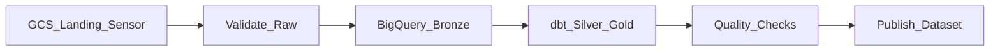

# 4. Cloud Composer Scenarios

## Scenario catalog

| # | Scenario | Pattern | Composer role |
| ---: | --- | --- | --- |
| 1 | Daily warehouse ELT | Medallion batch | Orchestrate BQ/dbt/Dataproc steps with DAG dependencies |
| 2 | Finance close pipeline | SLA-critical batch | T0 DAG with deadline sensors and paging |
| 3 | Lakehouse bronze → silver | Spark + catalog | Dataproc submit after GCS landing sensor |
| 4 | SaaS ingest + transform | Fivetran/Airbyte + dbt | Sensor or API trigger → dbt Cloud job |
| 5 | ML feature store refresh | Batch features | Feature validation → training → registry publish |
| 6 | Cross-domain dependencies | Dataset triggers | Upstream DAG publishes Airflow Dataset |
| 7 | Event-triggered backfill | Eventarc + REST | File event triggers parameterized DAG run |
| 8 | Multi-tenant data platform | Federated DAG repos | Shared Composer; domain prefixes and RBAC |
| 9 | Compliance audit exports | Immutable runs | Log retention + export task to locked GCS |
| 10 | Data quality gate | Branch operator | Fail path to quarantine; pass to gold layer |
| 11 | Incremental hourly loads | `@hourly` DAG | Partition param `data_interval_start` |
| 12 | Disaster recovery drill | Secondary env | Restore DAG bundle; run smoke DAG |
| 13 | Cost-aware scheduling | Off-peak cron | Stagger heavy DAGs; pools for BQ slots |
| 14 | Hybrid streaming + batch | Lambda arch | Composer reconciles stream aggregates nightly |
| 15 | Platform onboarding | Golden path DAG | Cookiecutter template deployed via CI |

## Detailed patterns

### Daily warehouse ELT



- Use **BigQueryInsertJobOperator** or **dbt** via Cloud Run/K8s pod operator.
- Tag DAG `tier:T1` and link [SLA Management](../../../../01_Fundamentals/03_Core_Concepts/04_SLA_Management.md).

### Event-triggered processing

```
GCS finalize → Eventarc → Pub/Sub → Cloud Function → Airflow REST API trigger
```

Pass `conf={"partition": "2026-06-20", "path": "gs://..."}` to DAG run.

### Dataset-driven downstream (Airflow 2.4+)

```python
from airflow.datasets import Dataset

orders_curated = Dataset("bigquery://project.dataset.orders")

with DAG(..., schedule=[orders_curated], ...) as downstream:
    ...
```

Upstream task declares `outlets=[orders_curated]` — replaces fragile external sensors.

### Dataproc batch orchestration

```
Check GCS prefix → DataprocSubmitJobOperator (Spark) → BQ load → update catalog
```

Keep Spark logic in `.py` on GCS; Composer only submits and monitors.

## Scenario selection guide

| Requirement | Recommended shape |
| --- | --- |
| Complex DAG with backfills | Composer |
| &lt; 5 API steps, event-only | Cloud Workflows instead |
| Strict 06:00 SLA | Composer + pools + dedicated workers |
| 500+ DAGs | Large environment size; DAG processor tuning |
| Portable to AWS MWAA | Avoid Composer-only operators in core path |

## Related

- [Production Configuration](07_Production_Configuration.md)
- [Scheduling Patterns](../../../../01_Fundamentals/03_Core_Concepts/01_Scheduling_Patterns.md)
- [Cloud Workflows Scenarios](../04_Cloud_Workflows_Learning_Guide/04_Scenarios.md)
