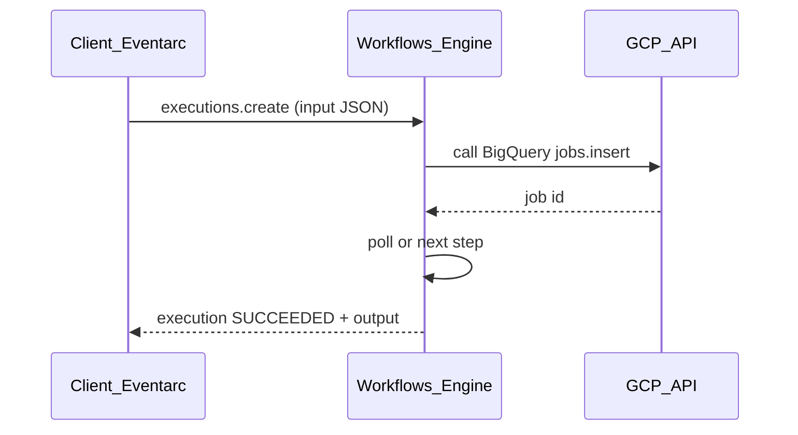

# 2. Architecture of Cloud Workflows

## Control plane vs execution plane

| Plane | Responsibility |
| --- | --- |
| **Control plane** | Workflow CRUD, deployment revisions, IAM, quota enforcement |
| **Execution plane** | Step-by-step interpretation, HTTP/API calls, state persistence, retry |

Fully serverless — Google scales execution capacity; you manage **concurrency quotas** and **workflow design**.

## Core objects

| Object | Description |
| --- | --- |
| **Workflow** | Named resource in a region: `projects/{p}/locations/{loc}/workflows/{name}` |
| **Revision** | Immutable deployed definition snapshot |
| **Execution** | Single run; states: `ACTIVE`, `SUCCEEDED`, `FAILED`, `CANCELLED`, `QUEUED` (backlog) |
| **Step** | Unit of work in YAML; each executed step billed |

## Step types (syntax)

| Construct | Purpose |
| --- | --- |
| `assign` | Set variables |
| `call` | HTTP, `http.post`, or `googleapis` connector |
| `switch` | Conditional branching |
| `for` | Iterate list/map |
| `parallel` | Concurrent branches |
| `try/retry` | Error handling |
| `raise` | Fail execution |
| `next` | Jump control |

## Execution lifecycle



State is **persisted between steps** — workflows can wait hours/days (callbacks).

## Internal vs external steps

| Type | Examples | Pricing category |
| --- | --- | --- |
| **Internal** | assign, switch, some connector prep | Internal step SKU |
| **External** | HTTP to non-Google domains, certain connector calls | External step SKU (higher) |

Classify steps during [Costing](06_Costing.md) modeling.

## Concurrency and backlogging

- **Active executions quota** per region — excess requests return `429` unless **backlogging** enabled.
- **Backlogged executions** enter `QUEUED` and start when quota frees.
- Enable backlogging for burst traffic (Eventarc storms).

## Connectors architecture

Workflows uses **Workload Identity**-style auth for `googleapis` calls:

```yaml
- call: googleapis.bigquery.v2.jobs.insert
  args:
    projectId: ${project}
    body: ${job_body}
```

No manual OAuth token handling for Google APIs when workflow SA has IAM roles.

## Security architecture

- **Service account per workflow** (recommended) — least privilege on target APIs.
- **Invoker IAM** — who may `executions.create`.
- **VPC-SC** — restrict which APIs are reachable.
- **Secret Manager** — fetch secrets in early step; pass in headers.

## Limits (architectural)

| Limit | Implication |
| --- | --- |
| Execution duration up to **1 year** | Long human approvals OK |
| Workflow definition size | Keep subworkflows for large flows |
| Concurrent executions | Plan quota increases for spikes |
| No arbitrary Python | Logic in YAML/expressions — complex transforms elsewhere |

## Related

- [Overview](01_Overview.md)
- [How to Use](03_How_To_Use.md)
- [Workflows syntax reference](https://cloud.google.com/workflows/docs/reference/syntax)
