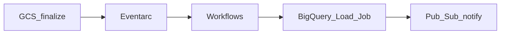

# 4. Cloud Workflows Scenarios

## Scenario catalog

| # | Scenario | Pattern | Workflows role |
| ---: | --- | --- | --- |
| 1 | File landed → validate → load | Event-driven ELT | Eventarc → BQ load → notify |
| 2 | HTTP webhook orchestration | API gateway | Validate payload → write → ack |
| 3 | Micro-ELT chain | Sequential API | GCS → BQ job → check row count |
| 4 | Approval before prod publish | Human callback | Wait for approver HTTP callback |
| 5 | Parallel vendor API calls | `parallel` step | Fan-out HTTP; merge results |
| 6 | Composer edge integration | Hybrid | Workflows pre-process; trigger Composer REST |
| 7 | Cloud Run job orchestration | Serverless batch | Run job → poll completion → next step |
| 8 | Pub/Sub message enrichment | Eventarc | Parse event → transform → republish |
| 9 | SaaS sync (Salesforce, etc.) | External HTTP | Paginated API loop with `for` |
| 10 | Data quality alert | Scheduled + BQ | Scheduler → query anomalies → Slack webhook |
| 11 | Infrastructure smoke test | Ops automation | Call health endpoints post-deploy |
| 12 | Dead-letter remediation | Retry + branch | Failed step → Pub/Sub DLQ topic |
| 13 | Multi-step Cloud Function chain | Replacement | Single workflow instead of 5 chained functions |
| 14 | BigQuery scheduled export | BQ → GCS | export job → verify object → Eventarc downstream |
| 15 | Lightweight ML invoke | Vertex endpoint | Preprocess → predict → store result |

## Detailed patterns

### File landed → BigQuery



Workflow input from event: bucket, object name, generation.

### Hybrid with Composer

```
Workflows: validate file + virus scan + metadata
  → HTTP POST Airflow REST API trigger `ingest_partner` DAG with conf
Composer: heavy multi-hour DAG
```

Keeps **Composer DAG count** lower; edge logic stays serverless.

### Parallel API aggregation

```yaml
- parallel_branches:
    parallel:
      shared: [base_url]
      branches:
        - branch_a:
            steps:
              - call_a: ...
        - branch_b:
            steps:
              - call_b: ...
```

### Scheduled anomaly check

```
Cloud Scheduler (hourly) → Workflows → BigQuery query → if rows>0 → PagerDuty HTTP
```

## Scenario selection guide

| Requirement | Workflows | Composer |
| --- | --- | --- |
| Event-only, &lt; 15 steps | **Yes** | Overkill |
| Daily 50-task DAG + backfill | No | **Yes** |
| Human approval wait days | **Yes** (callback) | Possible but heavier |
| OpenLineage batch lineage | Limited | **Yes** |
| Zero idle cost | **Yes** | No |

## Related

- [Composer Scenarios](../03_Cloud_Composer_Learning_Guide/04_Scenarios.md)
- [Production Configuration](07_Production_Configuration.md)
