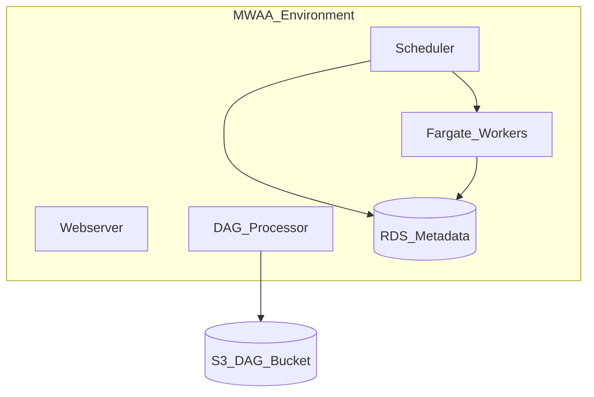
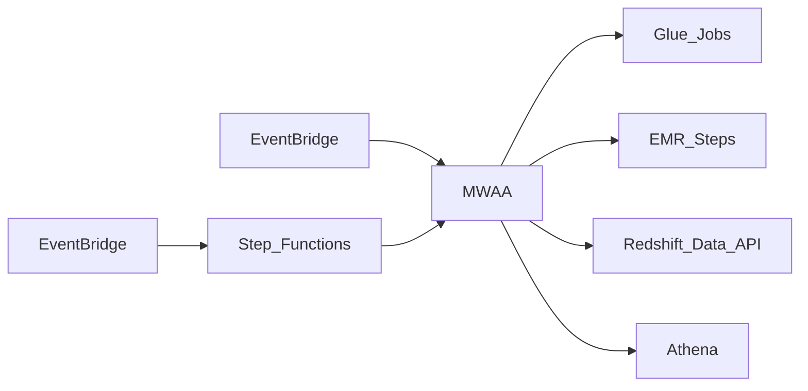

# 2. Architecture of Amazon MWAA

## Control plane vs data plane

| Plane | Responsibility |
| --- | --- |
| **Control plane (AWS-managed)** | Environment lifecycle, scheduler/webserver infrastructure, RDS metadata, patching, CloudWatch agents |
| **Data plane (your workloads)** | DAG parsing, task execution on Fargate workers, remote calls to Glue/EMR/APIs, logs to CloudWatch |

You do not SSH into MWAA workers. Scaling and patching are managed; you tune **worker bounds**, **environment class**, and **DAG design**.

## Environment components



| Component | Role |
| --- | --- |
| **Scheduler** | Creates DAG runs; enqueues task instances |
| **DAG processor** | Parses DAG files from S3 |
| **Workers** | Execute task processes on AWS Fargate |
| **Webserver** | Airflow UI and REST API |
| **Metadata DB** | Amazon RDS (PostgreSQL) — run state, variables, connections |
| **S3 bucket** | `dags/`, `plugins/`, `requirements.txt`, optional `data/` |

## Executor model

MWAA uses **CeleryExecutor** with Fargate-backed workers. Tasks are queued centrally and executed on workers until success/failure/retry.

Implications:

- Worker count caps **parallel task** capacity.
- Long-running tasks **hold worker slots** — use deferrable operators or offload to Glue/EMR.
- **Pools** limit concurrency per resource (e.g., Redshift connections).

## Scaling dimensions

| Dimension | Mechanism |
| --- | --- |
| **Horizontal (workers)** | Autoscaling between `minWorkers` and `maxWorkers` |
| **Environment class** | mw1.small → 2xlarge — scheduler/webserver/worker baseline |
| **Scheduler count** | Multiple schedulers on larger classes for HA and parse throughput |
| **Webserver capacity** | Scales with environment class |

See [Production Configuration](07_Production_Configuration.md) for tuning recipes.

## DAG deployment architecture

```
Git (source of truth) → CI (test DagBag) → aws s3 sync → s3://mwaa-env/dags/
                                              → plugins.zip, requirements.txt
```

**Anti-pattern:** Editing DAGs only in S3 without Git — breaks audit and CI.

## Network architecture

| Mode | Use |
| --- | --- |
| **Public webserver** | Dev only |
| **Private webserver** | Production — access via VPN, Direct Connect, or SSO proxy |
| **VPC** | Two subnets in different AZs required |
| **Security groups** | Restrict egress to AWS APIs and data plane |

Workers need egress to S3, Glue, EMR, Secrets Manager, and your warehouse endpoints.

## Security architecture

- **Execution role** — IAM role assumed by MWAA environment with least privilege.
- **Secrets Manager** — Airflow connections backend (`secrets.backend`).
- **User access** — IAM Identity Center / SSO to Airflow UI where configured.
- **KMS** — Encrypt S3 DAG bucket and RDS at rest.

## Integration topology (typical data platform)



## High availability and DR

- MWAA runs **multi-AZ** infrastructure within a region.
- **RDS backups** — understand RPO/RTO in [MWAA docs](https://docs.aws.amazon.com/mwaa/latest/userguide/disaster-recovery.html).
- **DR pattern:** Secondary MWAA environment in another region + S3 cross-region replication; failover is **manual** — runbook required.

## Related

- [Overview](01_Overview.md)
- [How to Use](03_How_To_Use.md)
- [Environment architecture (official)](https://docs.aws.amazon.com/mwaa/latest/userguide/networking-about.html)
