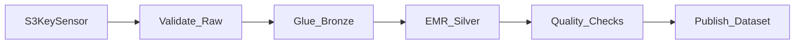

# 4. Amazon MWAA Scenarios

## Scenario catalog

| # | Scenario | Pattern | MWAA role |
| ---: | --- | --- | --- |
| 1 | Daily lakehouse ELT | Medallion batch | Orchestrate Glue/EMR/dbt steps with DAG dependencies |
| 2 | Finance close pipeline | SLA-critical batch | T0 DAG with deadline sensors and paging |
| 3 | S3 bronze → silver | Spark + catalog | EMR/Glue after S3 sensor |
| 4 | SaaS ingest + transform | Fivetran/Airbyte + dbt | Sensor or API trigger → dbt job |
| 5 | ML feature store refresh | Batch features | Validation → training → registry publish |
| 6 | Cross-domain dependencies | Dataset triggers | Upstream DAG publishes Airflow Dataset |
| 7 | Event-triggered backfill | EventBridge → REST | S3 event triggers parameterized DAG run |
| 8 | Multi-tenant data platform | Federated DAG repos | Shared MWAA; domain prefixes and RBAC |
| 9 | Compliance audit exports | Immutable runs | Log retention + export to S3 Object Lock |
| 10 | Data quality gate | Branch operator | Fail path to quarantine; pass to gold layer |
| 11 | Incremental hourly loads | `@hourly` DAG | Partition param `data_interval_start` |
| 12 | Disaster recovery drill | Secondary env | Restore DAG bundle; run smoke DAG |
| 13 | Cost-aware scheduling | Off-peak cron | Stagger heavy DAGs; pools for Glue DPU |
| 14 | Hybrid streaming + batch | Lambda arch | MWAA reconciles stream aggregates nightly |
| 15 | Step Functions handoff | Hybrid | SF handles event; MWAA runs nightly mesh |

## Detailed patterns

### Daily lakehouse ELT



- Use **GlueJobOperator** or **EmrAddStepsOperator**.
- Tag DAG `tier:T1` and link [SLA Management](../../../../01_Fundamentals/03_Core_Concepts/04_SLA_Management.md).

### Event-triggered processing

```
S3 Object Created → EventBridge → Lambda → MWAA REST API trigger
```

Pass `conf={"partition": "2026-06-20", "key": "landing/..."}` to DAG run. Alternative: **Step Functions** starts execution that triggers MWAA.

### Dataset-driven downstream (Airflow 2.4+)

```python
from airflow.datasets import Dataset

orders_curated = Dataset("s3://curated/orders")

with DAG(..., schedule=[orders_curated], ...) as downstream:
    ...
```

### Redshift / Athena orchestration

```
Glue catalog update → Redshift COPY → ANALYZE → grant permissions task
```

Use **RedshiftDataOperator** or **AthenaOperator** with pools limiting concurrent queries.

## Scenario selection guide

| Requirement | Recommended shape |
| --- | --- |
| Nightly 50+ task mesh | MWAA primary |
| S3 file → single Glue job | Step Functions (lighter) |
| Glue-only medallion | Glue Workflows + MWAA for non-Glue |
| Portable Airflow code | MWAA (same DAGs as Composer with provider swaps) |

## Related

- [Step Functions Scenarios](../05_Step_Functions_Learning_Guide/04_Scenarios.md)
- [Glue Workflows Architecture](../02.03.02.03.03_Glue_Workflows_Architecture.md)
