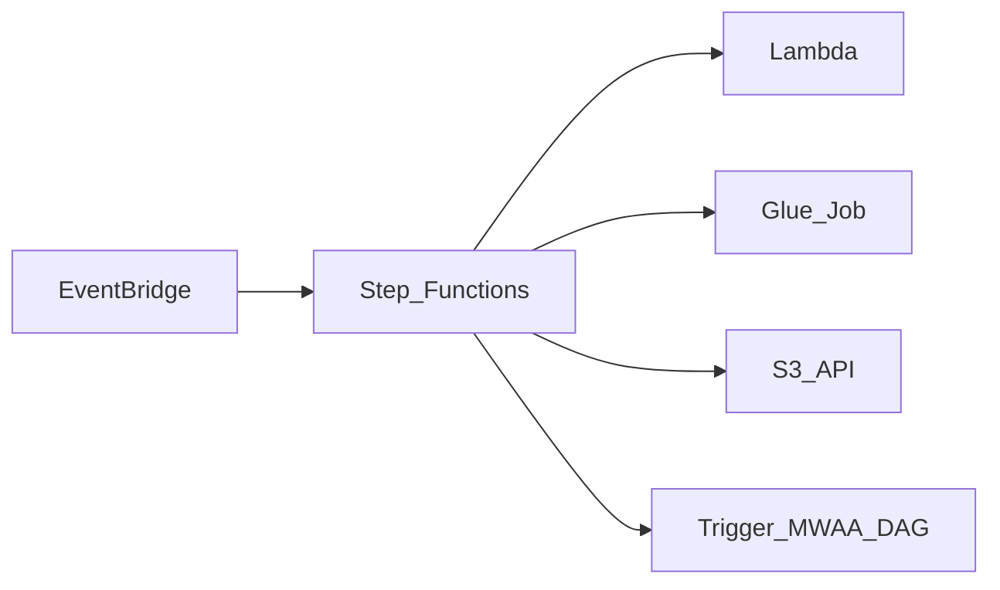

# 1. AWS Step Functions Overview

## What is Step Functions?

**AWS Step Functions** is a **fully managed, serverless workflow** service. You define **state machines** in Amazon States Language (ASL) — JSON or YAML — that coordinate Lambda, Glue, Batch, ECS, DynamoDB, and other AWS services. Step Functions is ideal for **event-driven glue**, API composition, and short-to-medium pipeline chains without operating Airflow infrastructure.

## Mental model

- **You own** state machine definitions, IAM roles, and error handling.
- **AWS owns** execution engine scaling, state persistence, and retry orchestration.
- **Compute** (Lambda, Glue DPUs) is billed **separately** from Step Functions transitions.

## Workflow types

| Type | Max duration | Semantics | Billing |
| --- | --- | --- | --- |
| **Standard** | 1 year | Exactly-once execution | Per state transition |
| **Express (async/sync)** | 5 minutes | At-least-once (async) | Per execution + duration + memory |

Choose **Standard** for auditable ETL chains and human callbacks. Choose **Express** for high-volume, short orchestration (webhooks, streaming adjacency).

## When to use Step Functions

| Use Step Functions when… | Consider alternatives when… |
| --- | --- |
| **Event-driven** S3 → Glue → notify chains | Complex nightly DAG mesh with backfill |
| **Serverless** orchestration with no idle cost | Team standard is Airflow → **MWAA** |
| **Human approval** via callback token | Glue-only jobs in catalog → **Glue Workflows** |
| **High fan-out** with Map state over partitions | Cross-cloud portable DAG code |
| **Sparse** executions (cost-sensitive glue) | 300+ interdependent batch tasks |

## Step Functions vs MWAA vs Glue Workflows

| Style | AWS service | Character |
| --- | --- | --- |
| **Serverless state machine** | Step Functions | ASL, per-transition or Express pricing |
| **Managed batch DAG platform** | MWAA | Python DAGs, Airflow UI |
| **Glue-native job graph** | Glue Workflows | Crawlers + Spark jobs only |

**Hybrid pattern:** Step Functions for ingress/event orchestration; MWAA for daily batch DAGs.

## Key capabilities at a glance

- **Workflow Studio** visual editor
- **Map** state for parallel partition processing
- **Callback** pattern (`waitForTaskToken`) for human steps
- **Distributed Map** for large S3 dataset fan-out
- **Integration** with 220+ AWS services via optimized integrations
- **X-Ray** tracing for latency analysis
- **Express** workflows up to 100,000+ executions/sec

## Learning path

Continue to [Architecture](02_Architecture.md) or [Scenarios](04_Scenarios.md).

## Related

- [Step Functions Architecture](../02.03.02.03.02_Step_Functions_Architecture.md)
- [MWAA Learning Guide](../04_MWAA_Learning_Guide/README.md)
- [Official Step Functions docs](https://docs.aws.amazon.com/step-functions/)
