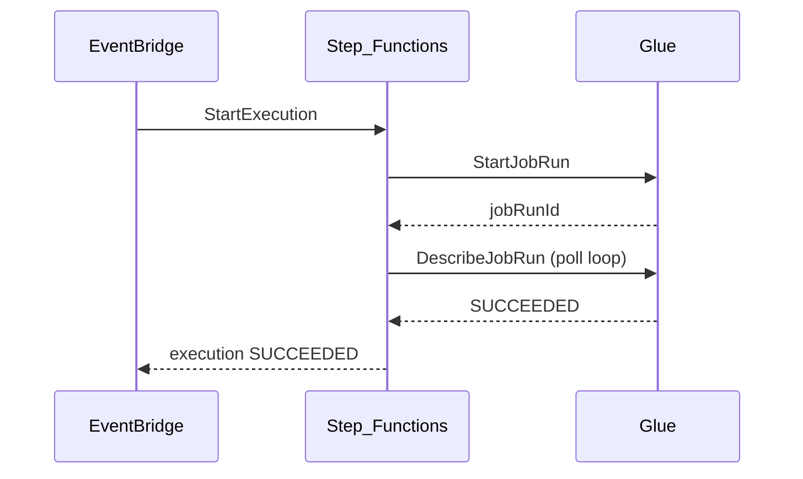

# 2. Architecture of AWS Step Functions

## Control plane vs execution plane

| Plane | Responsibility |
| --- | --- |
| **Control plane** | State machine CRUD, versioning, IAM, quota enforcement |
| **Execution plane** | State transitions, service integrations, retry, history persistence |

Fully serverless — AWS scales execution capacity; you manage **workflow design** and **IAM roles**.

## Core objects

| Object | Description |
| --- | --- |
| **State machine** | Named resource with ASL definition and execution role |
| **Execution** | Single run; statuses include `RUNNING`, `SUCCEEDED`, `FAILED`, `TIMED_OUT` |
| **State transition** | Billable unit in Standard workflows — each completed step |
| **Activity** | External worker polling pattern (legacy; prefer callbacks) |

## State types (common)

| State | Purpose |
| --- | --- |
| **Task** | Invoke Lambda, Glue, ECS, SDK integration |
| **Choice** | Branch on JSONPath |
| **Parallel** | Fan-out branches |
| **Map** | Iterate array; **Distributed Map** for S3 CSV/JSON fan-out |
| **Wait** | Delay or `waitForTaskToken` callback |
| **Pass / Fail / Succeed** | Control flow |

## Execution lifecycle (Standard)

Standard workflows persist **full execution history** (90 days) for debugging.

## Standard vs Express architecture

| Aspect | Standard | Express |
| --- | --- | --- |
| History | Full execution graph in console | CloudWatch Logs primarily |
| Rate | ~2,000 starts/sec (regional) | 100,000+ /sec |
| Semantics | Exactly-once | At-least-once (async) |
| Long-running | Up to 1 year | Max 5 minutes |
| Cost model | Per transition | Per request + GB-second |

## Integration patterns

| Integration type | Example |
| --- | --- |
| **Optimized** | `arn:aws:states:::lambda:invoke` |
| **AWS SDK** | `arn:aws:states:::aws-sdk:s3:getObject` |
| **Service integration** | Glue `startJobRun.sync` — waits for completion |
| **HTTP Task** | Call external REST APIs (Standard) |

## Concurrency and throttling

- **Standard:** State transition rate limits per region — burst may throttle.
- **Express:** Higher throughput; no transition rate cap.
- **Map state** — `MaxConcurrency` controls parallel branch limit.

## Security architecture

- **Execution role per state machine** — scoped IAM policies per target service.
- **Input/output filtering** — reduce sensitive data in execution history.
- **VPC** — Lambda/Glue tasks in VPC for private resource access.
- **KMS** — Encrypt execution data where required.

## Limits (architectural)

| Limit | Implication |
| --- | --- |
| Payload **256 KB** | Large payloads → S3 reference pattern |
| ASL definition size | Split into nested state machines |
| Express **5 min** max | Not for long batch; use Standard or MWAA |
| Map item limit | Use Distributed Map for millions of items |

## Related

- [Overview](01_Overview.md)
- [How to Use](03_How_To_Use.md)
- [ASL specification](https://docs.aws.amazon.com/step-functions/latest/dg/amazon-states-language.html)
