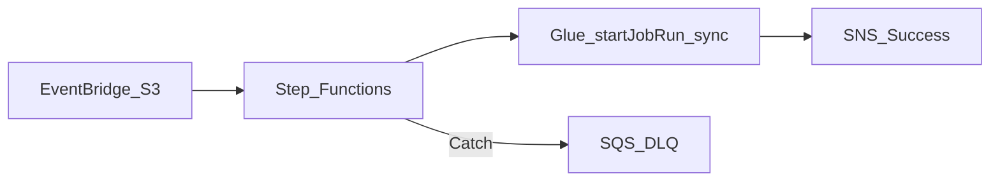

# 4. AWS Step Functions Scenarios

## Scenario catalog

| # | Scenario | Pattern | Step Functions role |
| ---: | --- | --- | --- |
| 1 | S3 file landed → ETL | Event-driven | EventBridge → Glue `.sync` |
| 2 | Multi-step API integration | SaaS glue | Lambda + HTTP Task chain |
| 3 | Parallel country loads | Map state | Fan-out Glue jobs per region |
| 4 | Human approval gate | Callback | `waitForTaskToken` before promote |
| 5 | MWAA DAG trigger | Hybrid | SF starts MWAA REST dagRun |
| 6 | Data quality alert | Scheduled | EventBridge cron → Athena query → SNS |
| 7 | Incremental file batch | Distributed Map | S3 manifest → per-file Lambda |
| 8 | DLQ on failure | Error handling | Catch → SNS / SQS dead letter |
| 9 | Express webhook ingress | High volume | Express sync workflow |
| 10 | Lakehouse bronze ingest | Standard | Crawler trigger → Glue → catalog update |
| 11 | Cross-account copy | Multi-account | AssumeRole → S3 copy → notify |
| 12 | ML pipeline stub | Orchestration only | Lambda preprocess → SageMaker (future) |
| 13 | Cost guardrail | Choice branch | Abort if file size &gt; threshold |
| 14 | Idempotent reprocess | S3 versioning | Check etag before Glue start |
| 15 | Compliance export | Audit chain | Standard with full history retention |

## Detailed patterns

### S3 landing → Glue (Standard)



Use **`.sync`** integration to wait for Glue completion without custom polling Lambda.

### Distributed Map over S3 prefix

```
ListObjectsV2 → Distributed Map (S3 item reader) → Lambda per object → aggregate
```

For millions of small files — offload iteration from MWAA DAG dynamic tasks.

### Hybrid with MWAA

Final state invokes Lambda that calls MWAA REST API:

```json
"TriggerNightlyDAG": {
  "Type": "Task",
  "Resource": "arn:aws:states:::lambda:invoke",
  "Parameters": {
    "FunctionName": "trigger-mwaa-dag",
    "Payload": {"dag_id": "orders_daily", "conf.$": "$"}
  },
  "End": true
}
```

### Express for high-frequency checks

EventBridge rule every minute → **Express** workflow → Athena query → CloudWatch metric. Standard would be cost-prohibitive at this frequency.

## Scenario selection guide

| Requirement | Recommended shape |
| --- | --- |
| &lt; 15 steps, event-driven | Step Functions Standard |
| &gt; 100K executions/day, &lt; 5 min | Step Functions Express |
| Complex DAG + backfill | MWAA |
| Glue-only job graph | Glue Workflows |

## Related

- [MWAA Scenarios](../04_MWAA_Learning_Guide/04_Scenarios.md)
- [Cloud Workflows Scenarios](../../02_GCP/04_Cloud_Workflows_Learning_Guide/04_Scenarios.md)
