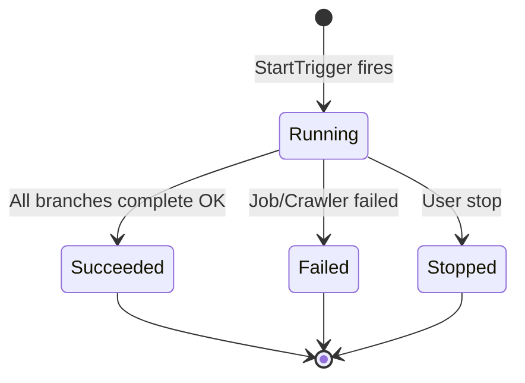
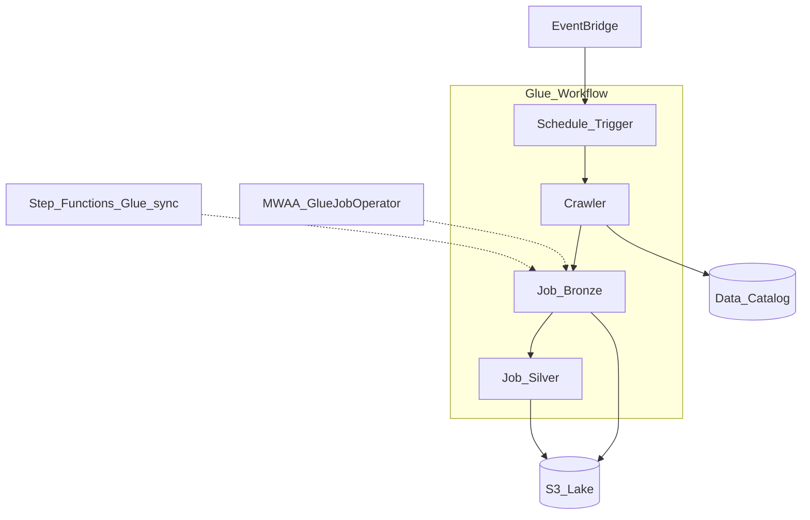

# 2. Architecture of AWS Glue Workflows

## Control plane vs execution plane

| Plane | Responsibility |
| --- | --- |
| **Control plane (Glue service)** | Workflow/trigger CRUD, run state, Studio graph, EventBridge trigger wiring |
| **Execution plane (Spark/crawler runtime)** | Job and crawler DPU consumption on managed Spark |

The workflow engine **coordinates** starts and dependencies; **compute cost** lives in jobs and crawlers.

## Workflow run lifecycle



Each **workflow run** has a unique ID and accumulates **run properties** (key-value JSON) as jobs write outputs.

## Trigger types

| Trigger type | Starts when | Typical use |
| --- | --- | --- |
| **Schedule** | Cron expression | Nightly medallion |
| **On-demand** | Manual / API `StartWorkflowRun` | Ad-hoc reprocess |
| **Conditional** | Named job/crawler reaches state | Bronze → silver promote |
| **EventBridge event** | S3/LF event pattern | File landing (batched) |

**Constraint:** Only **one** starting trigger (schedule or on-demand) per workflow.

## Dependency graph rules

- A conditional trigger fires when its **predicate job/crawler** completes with matching state.
- If a job is started **outside** the workflow, **in-workflow** conditional triggers that depend on it may **not fire** — start jobs from workflow triggers for consistent graphs.
- Limit **jobs + crawlers + triggers** to **≤ 100** per workflow (AWS recommendation).

## Components deep dive

| Component | Architecture note |
| --- | --- |
| **Spark ETL job** | Min 2 DPUs; Standard vs **Flex** execution class |
| **Python shell job** | 0.0625 DPU; lightweight scripts |
| **Crawler** | 10-minute minimum billing; DPU-based |
| **Job bookmark** | Per-job incremental state in Glue backend |
| **Data Catalog** | Hive-compatible metastore; workflow does not replace catalog governance |

## Workflow run properties

Jobs read/write properties via `getWorkflowRunProperties` / `putWorkflowRunProperties` in Glue SDK:

```
StartWorkflowRun → { "partition_date": "2026-06-20" }
  → Job1 writes { "row_count": 1500000 }
  → Job2 reads partition_date + row_count
```

Use for lightweight parameter passing — not for large payloads (keep under KB scale).

## Integration topology



External orchestrators invoke **individual Glue jobs** or **StartWorkflowRun** — they do not replace in-workflow trigger semantics.

## Security architecture

- **IAM role per job/crawler** — `glue.amazonaws.com` trust; S3/KMS scoped policies.
- **Lake Formation** — fine-grained table/column access for Spark jobs.
- **VPC** — Glue connections for JDBC sources in private subnets.
- **Encryption** — S3 SSE-KMS; job bookmark and catalog encryption at rest.

## Related

- [Overview](01_Overview.md)
- [How to Use](03_How_To_Use.md)
- [Workflow restrictions (official)](https://docs.aws.amazon.com/glue/latest/dg/blueprint_workflow_restrictions.html)
