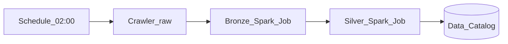

# 4. AWS Glue Workflows Scenarios

## Scenario catalog

| # | Scenario | Pattern | Glue Workflows role |
| ---: | --- | --- | --- |
| 1 | Medallion bronze → silver | Crawler → bronze → silver jobs | In-Glue dependency chain |
| 2 | Incremental daily ingest | Schedule + job bookmark | Conditional promote on success |
| 3 | Schema drift handling | Crawler → branch on new columns | Conditional + notification job |
| 4 | Multi-table lake bootstrap | Parallel crawlers → union job | Multiple conditional triggers |
| 5 | Raw landing event-driven | EventBridge S3 trigger | Batched file arrivals |
| 6 | Data quality gate | Job → Python shell DQ check | FAILED stops downstream |
| 7 | Catalog-first discovery | Crawler-only workflow | Schedule metadata refresh |
| 8 | Iceberg table maintenance | Spark job compaction chain | Sequential conditional jobs |
| 9 | Flex off-peak batch | FLEX execution class jobs | Nightly non-T0 window |
| 10 | Cross-workflow handoff | Workflow A completes → API start B | Run properties + Lambda |
| 11 | Hybrid with MWAA | MWAA starts Glue job outside graph | Use MWAA for non-Glue steps |
| 12 | Hybrid with Step Functions | SF `.sync` Glue + WF for catalog | Split by service boundary |
| 13 | Parameterized backfill | On-demand + run properties | `partition_date` per run |
| 14 | Failed job re-drive | Manual restart from failed node | Resume/stop workflow run |
| 15 | Cost-capped concurrency | MaxConcurrentRuns = 1 | Serialize heavy Spark |

## Detailed patterns

### Medallion bronze → silver



- Enable **job bookmarks** on bronze for incremental S3 reads.
- Silver job reads catalog table `raw.orders` → writes `curated.orders`.

### Incremental ingest with bookmark

```
Schedule → Job (bookmark enabled) → Conditional SUCCESS → downstream aggregate job
```

Reset bookmark only via controlled backfill runbook — accidental reset causes full reload.

### Event-driven landing (batched)

```
S3 Object Created → EventBridge trigger (batch ≤100, window ≤15 min) → bronze job
```

For per-file immediate processing at high volume, prefer **Step Functions** ingress → single Glue job with manifest.

### Data quality gate

Add Python shell or Spark job with assertions; on failure downstream conditional trigger (FAILED path) invokes SNS notify job — do not chain SUCCESS trigger to silver.

## Scenario selection guide

| Requirement | Recommended shape |
| --- | --- |
| All steps are Glue Spark/crawler | **Glue Workflows** |
| Glue + Redshift COPY + Slack | **MWAA** |
| S3 event → one Glue job | **Step Functions** or Event trigger |
| 150+ jobs in one graph | Split workflows (100-entity limit) |

## Related

- [MWAA Scenarios](../04_MWAA_Learning_Guide/04_Scenarios.md)
- [Step Functions Scenarios](../05_Step_Functions_Learning_Guide/04_Scenarios.md)
