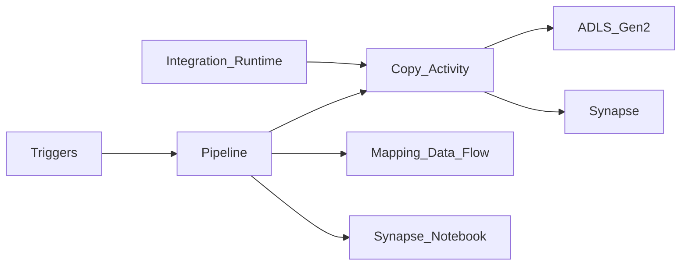

# 1. Azure Data Factory Overview

## What is Azure Data Factory?

**Azure Data Factory (ADF)** is Microsoft's **cloud-native data integration and orchestration** service. You define **pipelines** of **activities** (copy, transform, control flow) triggered on schedules or events. ADF orchestrates movement and transformation across Azure Blob/ADLS, Synapse, Azure SQL, Databricks, and on-premises sources via the **Self-Hosted Integration Runtime (IR)**.

ADF is the **default Azure control plane** for enterprise batch ingestion and ELT when teams want visual/JSON pipeline authoring and deep Microsoft data platform integration.

## Mental model

- **You own** pipeline JSON, linked services, datasets, IR sizing, and CI/CD.
- **Microsoft owns** control plane scaling, connector maintenance, and Azure IR compute allocation.
- **Heavy transform** runs on Spark (data flows), Synapse, or Databricks — not on the orchestration meter alone.

## ADF and Microsoft Fabric

**Microsoft Fabric Data Factory** extends ADF patterns inside Fabric tenants — pipelines, dataflows, and lakehouse integration with unified governance. For greenfield Fabric estates, author in Fabric; for standalone Azure, use ADF v2. Concepts (pipeline, activity, trigger) transfer between both.

## When to use ADF

| Use ADF when… | Consider alternatives when… |
| --- | --- |
| Azure/Synapse **lakehouse ingest** and ELT | Portable Airflow DAGs → **MWAA/Composer** or AKS Airflow |
| **Hybrid** on-prem SQL/Oracle to cloud | Simple file copy only → Functions + Event Grid |
| **Tumbling window** backfill with dependencies | Lightweight SaaS webhook glue → **Logic Apps** |
| **Purview lineage** integration required | Single Lambda chain on AWS → **Step Functions** |
| Visual pipeline + **90+ copy connectors** | Complex cross-cloud DAG mesh with Python-only ops |

## ADF vs Logic Apps vs Airflow

| Style | Service | Character |
| --- | --- | --- |
| **Data factory / ETL orchestrator** | ADF / Fabric | Pipelines, copy engine, data flows |
| **Serverless integration** | Logic Apps | Connectors, approvals, alerts |
| **Managed Airflow** | AKS Airflow / MWAA (multi-cloud) | Python DAGs, portable |

See [Logic Apps Learning Guide](../04_Logic_Apps_Learning_Guide/README.md) for operational glue patterns.

## Key capabilities at a glance

- **Copy activity** — 90+ connectors with DIU scaling
- **Mapping data flows** — visual Spark transform (vCore billing)
- **Control flow** — If, ForEach, Until, Switch, Filter
- **Triggers** — Schedule, tumbling window, storage events, custom
- **Integration Runtimes** — Azure, Self-Hosted, Azure-SSIS
- **Managed identity** + Key Vault for secrets
- **Purview** lineage and classification hooks
- **Git integration** — Azure DevOps / GitHub for CI/CD

## Learning path

Continue to [Architecture](02_Architecture.md) or [Scenarios](04_Scenarios.md).

## Related

- [Azure Data Factory Architecture](../02.03.02.04.01_Azure_Data_Factory_Architecture.md)
- [How to Use](03_How_To_Use.md)
- [Official ADF docs](https://learn.microsoft.com/en-us/azure/data-factory/)
