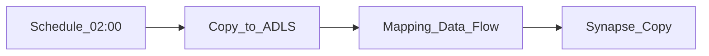

# 4. Azure Data Factory Scenarios

## Scenario catalog

| # | Scenario | Pattern | ADF role |
| ---: | --- | --- | --- |
| 1 | Daily lakehouse ingest | Copy → ADLS | Scheduled pipeline |
| 2 | Medallion bronze → silver | Copy + Mapping data flow | Sequential activities |
| 3 | Synapse dedicated pool load | Copy → DW | Polybase / COPY INTO |
| 4 | Hybrid SQL Server ingest | SHIR copy | On-prem to cloud |
| 5 | Tumbling window backfill | Partition dependency | Tumbling window trigger |
| 6 | Event-driven landing | Blob event trigger | Storage event trigger |
| 7 | Databricks transform | Notebook activity | ADF orchestrates DBX |
| 8 | dbt via Synapse notebook | Notebook chain | Transform in Synapse |
| 9 | Multi-tenant platform | Parameterized pipelines | ARM + CI/CD per domain |
| 10 | Purview lineage publish | Execute + catalog | Post-copy registration |
| 11 | SSIS migration | Azure-SSIS IR | Lift-and-shift packages |
| 12 | Fabric OneLake path | Fabric pipeline | Greenfield lakehouse |
| 13 | Incremental CDC | Delta/copy with watermark | Lookup + watermark column |
| 14 | Data quality gate | If Condition on count | Branch fail path |
| 15 | Logic Apps handoff | Logic App starts ADF | External trigger via REST |

## Detailed patterns

### Daily lakehouse ingest



Tag pipeline `tier:T1`; link [SLA Management](../../../../01_Fundamentals/03_Core_Concepts/04_SLA_Management.md).

### Tumbling window backfill

```
Trigger (hourly window) → pl_bronze(windowStart, windowEnd) → pl_silver (depends on success)
```

Use **dependsOn** with same trigger for dependency chains across pipelines.

### Hybrid on-premises

SHIR on corporate VM → Copy from SQL Server → ADLS. Scale DIUs for throughput; monitor SHIR CPU.

### Fabric migration path

New workloads: Fabric Data Factory pipelines targeting OneLake. Legacy: ADF until cutover — unify governance in Purview.

## Scenario selection guide

| Requirement | Recommended shape |
| --- | --- |
| Azure-native ELT at scale | **ADF / Fabric** |
| Portable Airflow DAGs | **AKS Airflow** or MWAA on AWS |
| Failure alert to Teams | **Logic Apps** + ADF |
| Single file webhook | Logic Apps → ADF pipeline |

## Related

- [Logic Apps Scenarios](../04_Logic_Apps_Learning_Guide/04_Scenarios.md)
- [MWAA Scenarios](../../03_AWS/04_MWAA_Learning_Guide/04_Scenarios.md)
