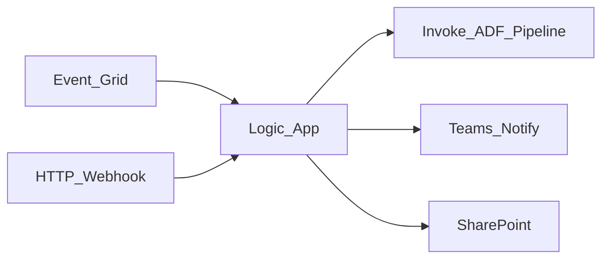

# 1. Azure Logic Apps Overview

## What are Azure Logic Apps?

**Azure Logic Apps** is a **serverless workflow** platform for integrating applications, data, and services through **connectors** and a visual designer (or JSON definition). In data platforms, Logic Apps handle **operational orchestration** — failure alerts, human approvals, webhooks, and SaaS integration — while **ADF** runs large-scale batch ETL.

## Mental model

- **You own** workflow definition, connector auth, retry policies, and hosting plan choice.
- **Microsoft owns** connector infrastructure (Consumption) or app runtime (Standard).
- **Data movement at scale** belongs in ADF — Logic Apps coordinate and notify.

## Hosting plans

| Plan | Model | Best for |
| --- | --- | --- |
| **Consumption** | Pay per trigger/action execution | Event-driven glue, low steady volume |
| **Standard** | Dedicated vCPU/memory (App Service plan) | VNet integration, high volume, predictable latency |

## When to use Logic Apps

| Use Logic Apps when… | Consider alternatives when… |
| --- | --- |
| **ADF failure** → Teams + ServiceNow alert | Nightly 50-activity ELT → **ADF** |
| **Human approval** before prod publish | Complex DAG backfill → **ADF** tumbling window or Airflow |
| **SaaS connector** (Salesforce, SharePoint) light pull | Heavy Spark transform → **ADF data flow** / Synapse |
| **HTTP webhook** ingress with few steps | High-throughput stream processing → Event Hubs + Stream Analytics |
| **VNet-private** API calls (Standard plan) | AWS-native estate → **Step Functions** |

## Logic Apps vs ADF vs Step Functions

| Style | Azure | AWS analog |
| --- | --- | --- |
| **Integration / serverless glue** | Logic Apps | Step Functions + API Gateway |
| **Data ETL orchestrator** | ADF | MWAA + Glue |
| **YAML/API composition** | — | Cloud Workflows (GCP) |

**Hybrid pattern:** Logic Apps for ingress/alerting; ADF for batch pipeline mesh.

## Key capabilities at a glance

- **1000+ connectors** (Microsoft + partner)
- **Built-in** HTTP, Request, Recurrence, Event Grid triggers
- **Stateful workflows** (Standard) with long-running patterns
- **Managed identity** for Azure resource calls
- **Key Vault** secret references
- **Integration Account** (B2B/EDI scenarios)
- **Call ADF pipeline** via HTTP or Azure Resource Manager connector

## Learning path

Continue to [Architecture](02_Architecture.md) or [Scenarios](04_Scenarios.md).

## Related

- [Logic Apps Architecture](../02.03.02.04.02_Logic_Apps_Architecture.md)
- [ADF Learning Guide](../03_Azure_Data_Factory_Learning_Guide/README.md)
- [Official Logic Apps docs](https://learn.microsoft.com/en-us/azure/logic-apps/)
