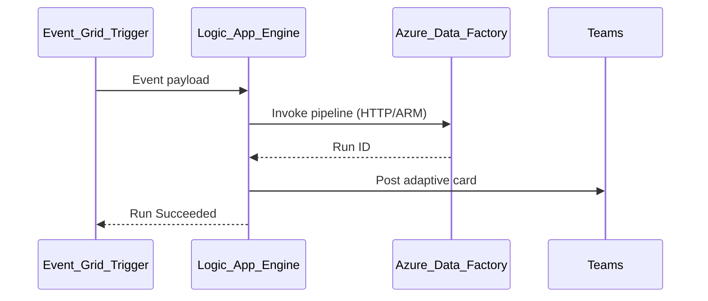

# 2. Architecture of Azure Logic Apps

## Control plane vs execution plane

| Plane | Responsibility |
| --- | --- |
| **Control plane** | Logic app resource, workflow CRUD, connector management, monitoring |
| **Execution plane** | Trigger evaluation, action invocation, connector runtime |

Consumption plan scales automatically; Standard plan runs on **App Service** dedicated capacity.

## Core objects

| Object | Description |
| --- | --- |
| **Logic app (resource)** | Container for one or more workflows (Standard) or single workflow (Consumption) |
| **Workflow** | Trigger + actions sequence (JSON definition) |
| **Trigger** | Starts run — Recurrence, HTTP Request, Event Grid, etc. |
| **Action** | Step after trigger — connector call, condition, loop |
| **Connection** | Authenticated connector instance (OAuth, managed identity) |

## Consumption vs Standard architecture

| Aspect | Consumption | Standard |
| --- | --- | --- |
| Hosting | Multi-tenant | Single-tenant App Service |
| VNet | Limited | Full VNet integration |
| Built-in actions | Billed per execution | Many built-ins free |
| Stateful workflows | Durable Functions backend | Native stateful workflows |
| Local dev | Cloud-first | Docker / VS Code local |

## Workflow execution lifecycle

## Connector architecture

| Type | Billing (Consumption) | Example |
| --- | --- | --- |
| **Built-in** | Lower / included patterns | HTTP, Compose, Condition |
| **Standard managed** | Per action | Office 365, Azure Blob |
| **Enterprise** | Premium tier | SAP, IBM MQ |

Use **managed identity** instead of stored passwords for first-party Azure connectors.

## Integration with ADF

| Pattern | Mechanism |
| --- | --- |
| Start ADF pipeline | HTTP to ADF REST API or **Azure Resource Manager** connector |
| React to ADF failure | Event Grid subscription on `Microsoft.DataFactory/PipelineRun` |
| Approval gate | Wait for approval action → resume deployment pipeline |

## Security architecture

- **Standard plan in VNet** for private API and on-prem connector access.
- **Key Vault** references for OAuth secrets.
- **Diagnostic settings** → Log Analytics for audit.
- **RBAC** — Logic App Contributor vs separate connection owners.

## Limits (architectural)

| Limit | Implication |
| --- | --- |
| Run history retention | Configure storage account (Consumption) |
| Action timeout | Long waits → use durable patterns or ADF |
| Payload size | Large files → ADF copy, not Logic Apps body |
| Connector throttling | Backoff policies; Service Bus buffer |

## Related

- [Overview](01_Overview.md)
- [How to Use](03_How_To_Use.md)
- [Logic Apps limits](https://learn.microsoft.com/en-us/azure/logic-apps/logic-apps-limits-and-config)
