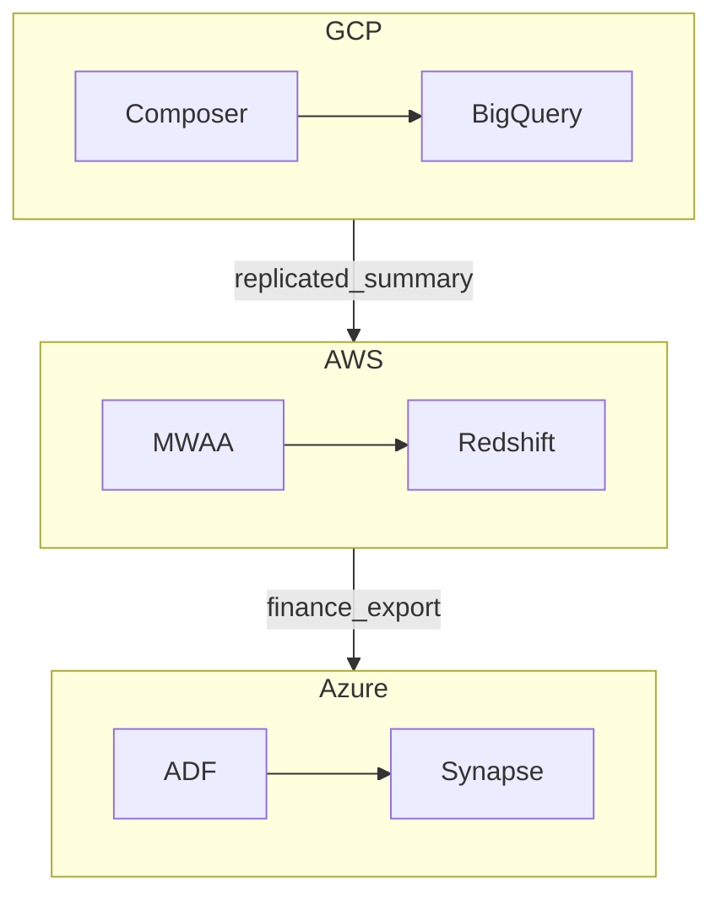

# Multi-Cloud Orchestration Patterns

## Purpose

Enterprises rarely orchestrate on a single hyperscaler. This document covers patterns when **pipelines span GCP, AWS, and Azure** — or when orchestration must remain **portable** across clouds.

## Pattern catalog

| Pattern | Description | When |
| --- | --- | --- |
| **Per-cloud orchestrator** | Composer in GCP, MWAA in AWS, ADF in Azure | Default — data locality and IAM boundaries |
| **Portable Airflow** | Same DAG code; cloud-specific connections/operators | Multi-cloud with shared Airflow skills |
| **Central orchestrator + remote tasks** | One Airflow invokes cross-cloud HTTP/API jobs | Strong central ops (watch latency and auth) |
| **Event bridge** | Cloud A publishes event → Cloud B workflow starts | Loose coupling; catalog-driven |
| **Abstraction layer** | Prefect/Dagster/Kubernetes agent in each cloud | Greenfield unified control plane |
| **ETL replication** | Orchestrator only in source cloud; replicate data then local orchestrate | Regulatory data residency |

## Per-cloud orchestrator (recommended default)

Each domain uses **native managed orchestrator** in its cloud. Cross-cloud handoffs via **object storage replication**, **shared catalog**, or **API** — not a single scheduler spanning all APIs.

## Portable Airflow pattern

| Layer | Portable | Cloud-specific |
| --- | --- | --- |
| DAG structure | Task graph, dependencies | — |
| Business logic | Python callables in wheel | — |
| Connections | — | BigQuery vs Redshift hooks |
| Execution | — | Composer vs MWAA environment |
| Secrets | Interface | Secret Manager vs Secrets Manager vs Key Vault |

Maintain internal **`platform-airflow-lib`** with operator wrappers to minimize DAG diff across clouds.

## Cross-cloud triggers

| Mechanism | Example |
| --- | --- |
| **Object replication** | GCS → S3 sync completes → S3 EventBridge → Step Functions |
| **Pub/Sub → webhook** | GCP completion message → AWS API Gateway → MWAA REST |
| **Catalog event** | Purview/DataHub "dataset updated" → trigger in consumer cloud |
| **Orchestration metadata** | Control table `pipeline_ready` polled by sensor (legacy) |

Prefer **events + contracts** over cross-cloud sensors polling every minute.

## Anti-patterns

1. **Single cron server orchestrating all clouds** — brittle credentials and blast radius.
2. **Duplicate DAG logic** per cloud without shared library — drift guaranteed.
3. **Cross-cloud synchronous chains** — latency and partial failure complexity.
4. **Ignoring residency** — orchestrating data movement against compliance rules.

## Supporting services (all clouds)

| Concern | GCP | AWS | Azure |
| --- | --- | --- | --- |
| IaC | Terraform / Deployment Manager | Terraform / CloudFormation | Terraform / Bicep |
| Secrets | Secret Manager | Secrets Manager | Key Vault |
| Identity | Workload Identity | IAM roles | Managed identity |
| Observability | Cloud Monitoring | CloudWatch | Azure Monitor |

Platform engineering docs: [Platform Engineering](../02.03.02.06_Platform_Engineering/02.03.02.06.01_Platform_Provisioning.md) (provisioning orchestrator environments).

## Related

- [Cloud Orchestration Reference Architecture](../01_Overview/01_Cloud_Orchestration_Reference_Architecture.md)
- [Managed Workflows](../01_Overview/02_Managed_Workflows.md)
- [Orchestration Strategy](../../01_Fundamentals/02_Strategy/01_Orchestration_Strategy.md)
