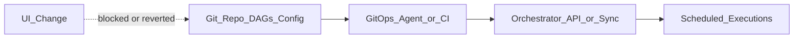

# GitOps for Data

## Problem

Orchestration state diverges from Git when operators change schedules, variables, or connections in the UI. **GitOps** makes the repository the single source of truth; the orchestrator **reconciles** to declared desired state.

## Pattern

## What belongs in Git

| Artifact | Examples |
| --- | --- |
| Workflow definitions | DAGs, Prefect deployments, Kestra flows |
| Config | airflow.cfg overlays, pool definitions as code |
| Variables (non-secret) | Feature flags, dataset URIs |
| Infrastructure | Helm values, Terraform for orchestrator |

Secrets stay in vault / cloud secret manager; Git references **connection names** only.

## Reconciliation modes

| Mode | Behavior | Fit |
| --- | --- | --- |
| **Sync on merge** | CI pushes to orchestrator on main | Airflow S3/GCS DAG folder |
| **Pull reconcile** | Agent polls Git every N minutes | Self-hosted Airflow + git-sync sidecar |
| **Declarative API** | Controller applies CRDs | Argo CD + K8s-native workflows |

## Orchestrator notes

| Platform | GitOps approach |
| --- | --- |
| Airflow / MWAA / Composer | DAG folder in Git → S3/GCS sync |
| Dagster | Code locations from Git tag via CI |
| Prefect | prefect deploy from GitHub Action |
| Kestra | Flow files in Git; server loads from repository backend |

## Related

- [CI/CD for Data](01_CI_CD_For_Data.md)
- [Data Release Management](04_Data_Release_Management.md)
