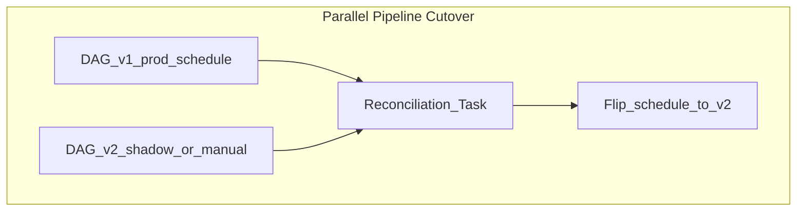

# Data Deployment Strategy

## Problem

Application blue/green does not map cleanly to data: **schema changes**, **backfills**, and **dual writes** require orchestration-aware deployment strategies.

## Deployment strategies

| Strategy | Orchestration behavior | When to use |
| --- | --- | --- |
| **Big bang** | Pause DAG → deploy → resume | Low-risk config-only changes |
| **Parallel pipeline** | New DAG version runs alongside old | Major logic rewrite with compare window |
| **Feature flag task** | Single DAG branches on variable | Incremental task rollout |
| **Expand-contract** | Additive schema first; cutover task later | Warehouse schema migrations |
| **Backfill-first** | Deploy idle; run historical backfill before cutover | Partition model changes |

## Rollback

| Failure type | Rollback action |
| --- | --- |
| Parse error | Revert Git; previous DAG bundle still in object storage |
| Logic bug | Pause new DAG; re-enable previous version |
| Bad data written | Run compensating DAG; quarantine partition |

Orchestrator metadata (run history) is **not** rolled back - plan idempotent compensating tasks.

## Related

- [CI/CD for Data](01_CI_CD_For_Data.md)
- [Data Release Management](04_Data_Release_Management.md)
- [Scheduling Patterns](../../01_Fundamentals/03_Core_Concepts/01_Scheduling_Patterns.md)
