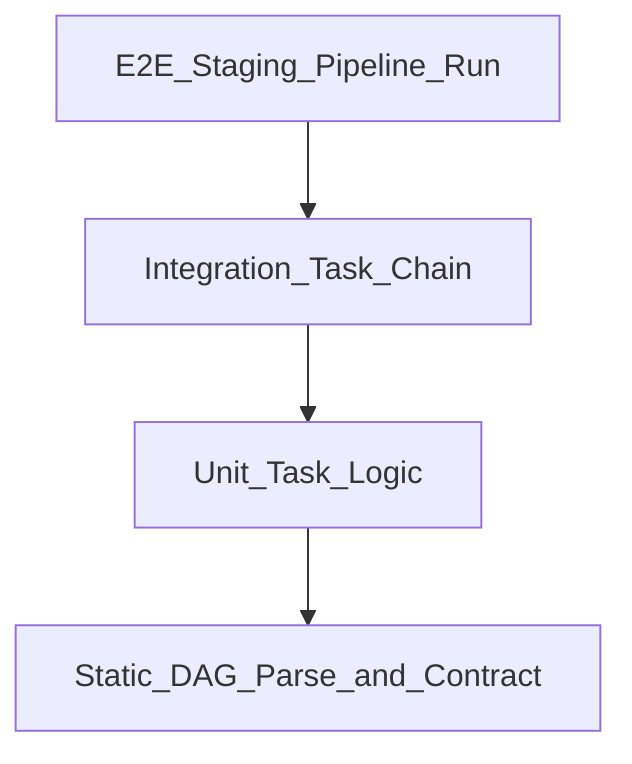

# Data Testing Strategy

## Problem

Orchestration proves **tasks ran**; testing proves **data is correct**. A testing strategy embeds validation at every layer the orchestrator touches.

## Test pyramid for orchestrated pipelines

| Layer | What | Where |
| --- | --- | --- |
| **Static** | DAG cycle-free, naming standards, no import errors | CI |
| **Unit** | Transform functions with fixtures | CI |
| **Contract** | Schema expectations vs registry | CI + pre-prod |
| **Integration** | Task against sandbox DB | Staging orchestrator |
| **E2E** | Full DAG run + row counts | Staging |
| **Production monitors** | Freshness, volume, null rate | Observability |

## Orchestration integration

| Pattern | Implementation |
| --- | --- |
| **Test DAG** | dag_id suffix _test triggered on PR |
| **Branching** | @task.branch on quality result |
| **Blocking gate** | dbt test task before publish task |
| **Sensor test mode** | Short-circuit external sensors in CI |

## Tools

| Tool | Role |
| --- | --- |
| dbt tests | Transform validation inside DAG |
| Great Expectations | Checkpoint task in workflow |
| Soda / Monte Carlo | Observability hooks post-run |

## Related

- [Automated Validation](06_Automated_Validation.md)
- [CI/CD for Data](01_CI_CD_For_Data.md)
