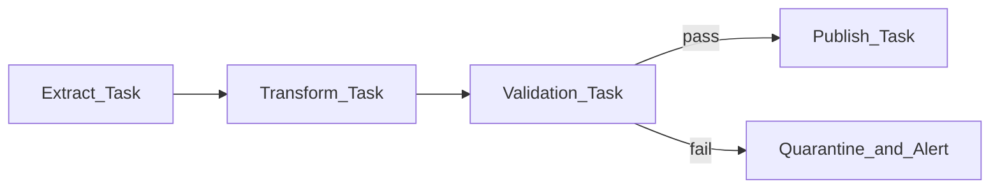

# Automated Validation

## Problem

Manual spot-checks after nightly batches do not scale. **Automated validation** runs inside or immediately after orchestrated tasks and **blocks downstream** on failure.

## Pattern

## Validation types

| Type | Example | Orchestration hook |
| --- | --- | --- |
| **Row count** | ±5% vs prior day | Task fails → skip publish |
| **Schema** | Required columns present | Branch to remediation DAG |
| **Referential** | FK match rate > 99.9% | Block gold layer sensor |
| **Business rule** | Revenue >= 0 | PagerDuty on fail |
| **Cross-pipeline** | Staging count = prod input | Dataset dependency gate |

## Fail-fast vs fail-safe

| Policy | Behavior | Use when |
| --- | --- | --- |
| **Fail-fast** | Stop DAG; no partial publish | Financial, regulatory |
| **Fail-safe** | Publish to quarantine schema | Exploratory analytics |
| **Degrade** | Publish with quality flag column | Consumer can filter |

## Active metadata loop

Failed validation emits event → catalog marks dataset **degraded** → [Active Metadata](../../01_Fundamentals/06_Active_Metadata/01_Active_Metadata.md) pauses downstream DAGs.

## Related

- [Data Testing Strategy](05_Data_Testing_Strategy.md)
- [Retry and Idempotency](../../01_Fundamentals/03_Core_Concepts/03_Retry_Strategies.md)
