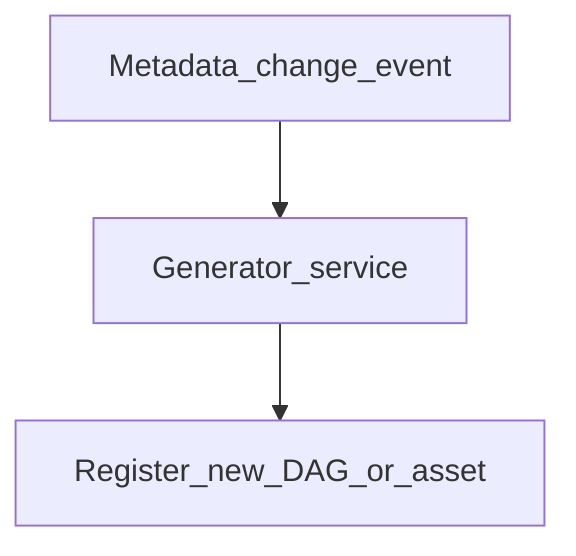

# Dynamic Pipeline Generation

## Problem

Static DAG files cannot represent **tenant-specific**, **region-specific**, or **schema-evolving** workloads at scale. Dynamic generation creates orchestration graphs **at parse time or runtime** from metadata.

## Generation timing

| When | Mechanism | Example |
| --- | --- | --- |
| **Parse time** | Python loop in DAG file | Airflow dynamic task mapping |
| **Deploy time** | CI compiler | YAML → 500 Kestra flows |
| **Runtime** | API-triggered subflows | Prefect subflows per customer |
| **Event time** | Metadata event | New table → auto-register ingest DAG |

## Airflow 2.x dynamic task mapping

Single DAG definition expands to N task instances from metadata query - reduces DAG proliferation.

## Risks and mitigations

| Risk | Mitigation |
| --- | --- |
| Scheduler overload | Cap max dynamic tasks; pool limits |
| Opaque graphs | Emit generated manifest to catalog |
| Untested combos | Property-based tests on generator |

## Related

- [Metadata-Driven Framework](01_Metadata_Driven_Framework.md)
- [Metadata Automation](06_Metadata_Automation.md)
