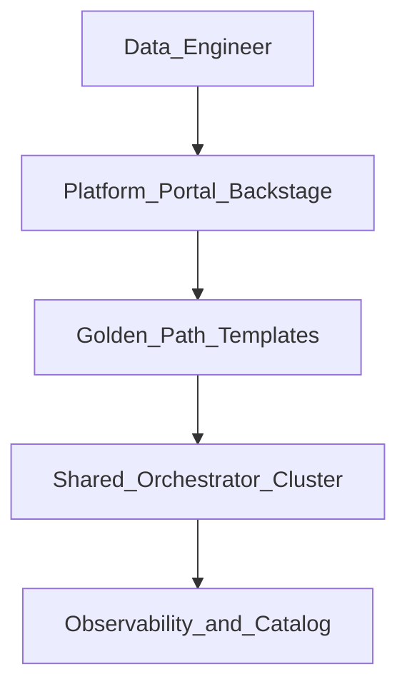

# Internal Developer Platform for Data

## Problem

Every team rolling its own Airflow namespace, secrets, and CI leads to **fragmented operations** and inconsistent SLAs. An **Internal Developer Platform (IDP)** offers golden-path orchestration self-service.

## Platform architecture

## Platform capabilities

| Capability | Developer experience |
| --- | --- |
| **Pipeline scaffold** | cookiecutter → Git repo with CI + sample DAG |
| **Environment provision** | Namespace, pools, connections via ticket or self-service |
| **Deploy** | Merge to main → auto-sync to dev/stg/prod |
| **Operate** | Unified dashboard: runs, logs, costs, lineage |
| **Policy** | Guardrails: naming, tags, max runtime, approved operators |

## Orchestration choices for IDP

| Model | Notes |
| --- | --- |
| **Shared multi-tenant Airflow** | RBAC per team; pool quotas |
| **Dagster code locations** | Strong asset boundaries per repo |
| **Namespace-per-team K8s** | Argo / Flyte for container-native teams |

## Team topology

Platform team owns control plane, CI templates, SLOs. Product data teams own DAG logic and data quality.

## Related

- [Platform Engineering stubs](../../02_Cloud_Services/02.03.02.06_Platform_Engineering/README.md)
- [Self-Service Platform](../../08_Integration_Patterns/01_Self_Service_Platform.md)
- [CI/CD for Data](../01_DataOps_Patterns/01_CI_CD_For_Data.md)
