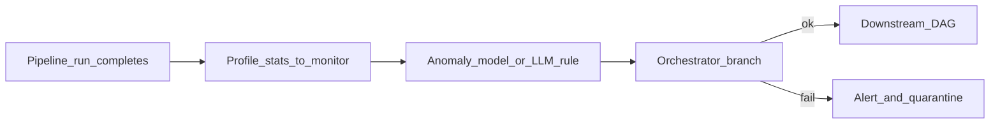

# AI Data Quality

## Problem

Rule-based DQ misses subtle drift (distribution shift, new enum values). **AI-assisted quality** augments orchestrated checkpoints with anomaly detection and natural-language rule authoring.

## Pattern

## Integration with orchestration

| Approach | Implementation |
| --- | --- |
| **LLM-authored rules** | Prompt → GE expectation JSON → validation task |
| **Anomaly scores** | Write score to metadata; Active Metadata blocks publish |
| **Root cause** | LLM summarizes failed checks + recent deploys |

Embed validation as **first-class tasks** - not ad-hoc notebooks after the fact.

## Related

- [Automated Validation](../01_DataOps_Patterns/06_Automated_Validation.md)
- [Active Metadata](../../01_Fundamentals/06_Active_Metadata/01_Active_Metadata.md)
