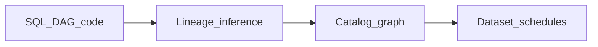

# AI Lineage Generation

## Problem

Incomplete lineage breaks impact analysis and dataset scheduling. **AI lineage generation** infers edges from SQL, logs, and code when OpenLineage emitters are missing - then **feeds** the orchestrator dependency graph.

## Sources for inference

| Source | Inference |
| --- | --- |
| SQL AST | Table read/write edges |
| dbt manifest | Model dependencies |
| Airflow DAG parse | Task → dataset heuristics |
| Run logs | Actual tables touched |

## Human-in-the-loop

Suggested edges marked confidence: low until steward confirms - then bind Airflow Dataset or Dagster asset dependency.

## Related

- [Metadata Automation](../02_Metadata_Driven/06_Metadata_Automation.md)
- [Metadata Orchestration](../02_Metadata_Driven/07_Metadata_Orchestration.md)
