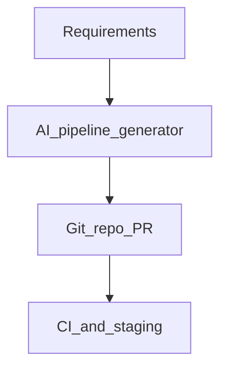

# AI Pipeline Generation

## Problem

Greenfield pipelines require days of scaffolding. **AI pipeline generation** produces end-to-end drafts: ingest → transform → test → publish, from requirements or source analysis.

## Generation inputs

- Natural language requirement ("daily customer 360 from CRM and orders")
- Source connection metadata
- Target catalog zone (bronze/silver/gold)
- SLA tier and orchestrator target (Airflow, Dagster, Kestra)

## Output bundle

| Artifact | Purpose |
| --- | --- |
| Orchestrator definition | DAG / flow / assets |
| dbt project slice | Transform models |
| CI workflow | Parse and staging deploy |
| Config | Connections template (no secrets) |
| DQ checks | Starter expectations |

## Maturity path

Start with **internal templates + LLM fill** (constrained) before fully free-form generation.

## Related

- [AI Code Generation](03_AI_Code_Generation.md)
- [Dynamic Pipeline Generation](../02_Metadata_Driven/05_Dynamic_Pipeline_Generation.md)
- [Internal Developer Platform](../03_Platform_Patterns/01_Internal_Developer_Platform.md)
