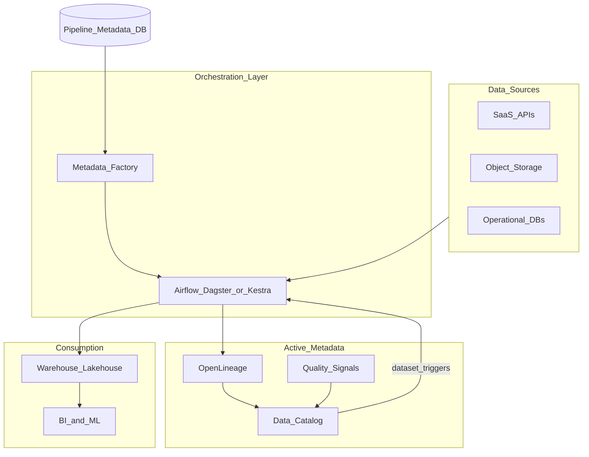

# Metadata-Driven Orchestration Reference Architecture

## Purpose

End-to-end reference for **metadata-driven batch orchestration** - catalog, lineage, and scheduler closed loop.

## Architecture

## Components

| Layer | Responsibility |
| --- | --- |
| **Pipeline metadata DB** | Sources, schedules, SLAs, mappings |
| **Factory / compiler** | Generates DAGs or assets from metadata |
| **Orchestrator** | Schedules, retries, pools |
| **Catalog** | Datasets, lineage, ownership |
| **Quality** | Checks feed active metadata |
| **Warehouse** | Bronze/silver/gold execution target |

## Non-functional requirements

| NFR | Target |
| --- | --- |
| T0 SLA | 99.5% on-time completion |
| Lineage coverage | 100% prod tasks emit OpenLineage |
| Deploy frequency | Daily per team with CI gates |
| RTO control plane | < 1 h |

## Related

- [Metadata-Driven Framework](../04_Architecture_Patterns/02_Metadata_Driven/01_Metadata_Driven_Framework.md)
- [Catalog Integration](../08_Integration_Patterns/03_Catalog_And_Lineage_Integration.md)