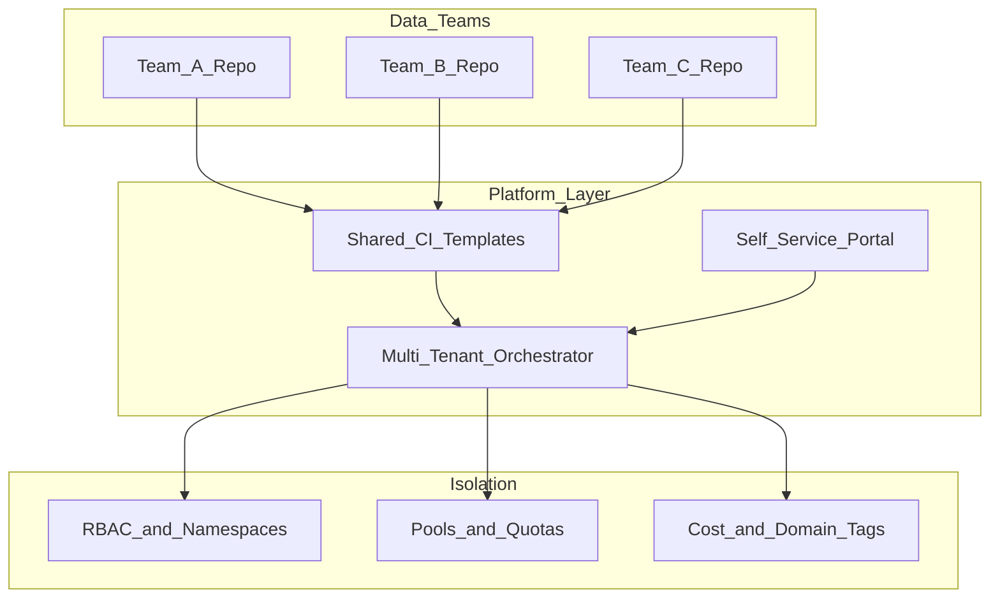

# Multi-Tenant Data Platform Reference Architecture

## Purpose

Reference for **shared orchestration platform** serving many data product teams with isolation, quotas, and self-service.

## Architecture

## Tenancy models

| Model | Isolation | Complexity |
| --- | --- | --- |
| **Folder + RBAC** | DAG prefix per team | Low |
| **Namespace / deployment** | Prefect work pools, Dagster code locations | Medium |
| **Cluster per team** | Separate MWAA/Composer env | High cost, strong isolation |

## Platform mandates

- Golden path template repos only for prod
- Mandatory tags: `domain`, `cost_center`, `tier`, `owner`
- No shared production connections across teams
- Per-team pool slot caps

## Related

- [Self-Service Platform](../08_Integration_Patterns/01_Self_Service_Platform.md)
- [Internal Developer Platform](../04_Architecture_Patterns/03_Platform_Patterns/01_Internal_Developer_Platform.md)