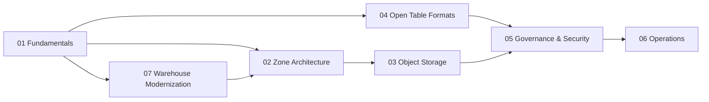

# 02.05.03 Lakehouse Architecture

> Status: 0 complete / 0 draft / 0 review / 36 stub (36 topics across 7 pillars)

## Purpose

Lakehouse storage design: open table formats on object storage, zone architecture, governance, operations, and warehouse modernization journeys.

## Numbering standard

```
02.05.03                    Lakehouse section
02.05.03.PP_Pillar/         Pillar (.01 fundamentals … .07 warehouse modernization)
02.05.03.PP.SS_Subsection/  Subsection within pillar
02.05.03.PP.SS.NN_Topic.md  Topic file
```

**Front matter:** pillar READMEs use `section: "02.05.03.0N"`; topic files use granular pillar IDs.

## Pillars

| # | Pillar | Path | Description |
| --- | --- | --- | --- |
| 02.05.03.01 | [Fundamentals](01_Fundamentals/README.md) | `01_Fundamentals/` | Lakehouse framework, reference model, strategy, anti-patterns |
| 02.05.03.02 | [Zone Architecture](02_Zone_Architecture/README.md) | `02_Zone_Architecture/` | Raw, trusted, and curated zone design |
| 02.05.03.03 | [Object Storage](03_Object_Storage/README.md) | `03_Object_Storage/` | Object storage foundations, lifecycle, performance |
| 02.05.03.04 | [Open Table Formats](04_Open_Table_Formats/README.md) | `04_Open_Table_Formats/` | Format selection, Iceberg/Hudi/Delta, interoperability |
| 02.05.03.05 | [Governance & Security](05_Governance_And_Security/README.md) | `05_Governance_And_Security/` | Lake, storage, and table governance; security; metadata |
| 02.05.03.06 | [Operations](06_Operations/README.md) | `06_Operations/` | Compaction, optimization, maintenance |
| 02.05.03.07 | [Warehouse Modernization](07_Warehouse_Modernization/README.md) | `07_Warehouse_Modernization/` | Assessment, migration, consolidation, decommissioning |

## Reader journey



## Start here

- [Lakehouse Framework](01_Fundamentals/01_Overview/01_Lakehouse_Framework.md)
- [Storage Reference Model](01_Fundamentals/01_Overview/02_Storage_Reference_Model.md)
- [Open Table Format Strategy](01_Fundamentals/02_Strategy/01_Open_Table_Format_Strategy.md)
- [Format Comparison Framework](04_Open_Table_Formats/01_Selection/01_Format_Comparison_Framework.md)

## Related

- [02.05 Data Storage Architecture](../README.md)
- [Medallion and Zones](../../../02_Data_Transformation_Architecture/04_Shared_Foundations/01_Fundamentals/03_Medallion_And_Zones/) — transformation-layer zone detail (cross-link, do not duplicate)
- [02 Data Engineering Architecture](../../README.md)
